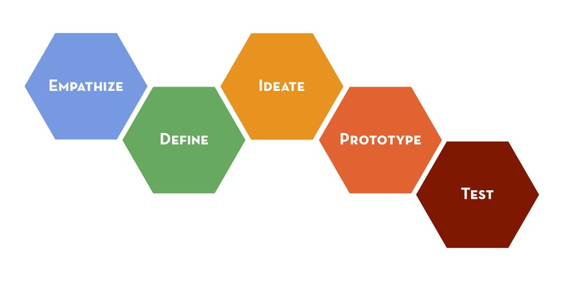
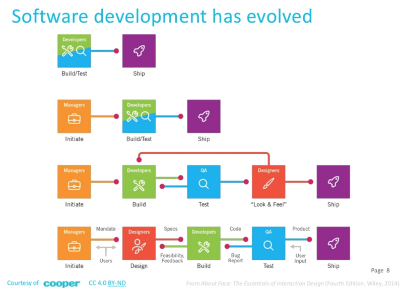

# 前言

2015年4月，我在一个国内交付项目上，比较“全程”的跟踪了一个项目从启动到进入开发阶段的整个过程。我们根据售前阶段的输出对项目有了大致的了解，然后从北京飞到深圳，和客户一起进行了为期一周的需求梳理和项目计划，与此同时，用户体验设计师负责梳理信息架构，原型设计，最后形成视觉设计稿（唐婉莹负责视觉设计）。

与以往的经验不同的是，整个过程我们和客户（需求的提出方）一起合作，指定计划，并快速归纳、指定出一个可执行的方案。在需求梳理阶段结束的时候，我们形成了一个项目计划，重要的是，我们知道了这个项目最终会服务于谁，谁会从中受益，项目进行过程中有哪些风险，有哪些资源限制，为什么要做这样的决策而不是相反等等。

不得不说，这个过程在一定程度上颠覆了我对软件开发的认识。如果说软件的生命周期是一本书（分为上中下三册）的话，平时我所理解的开发则跳过了书的前几章，以及“中下”两册。我们涉及的一些工程实践，开发方法论，都是围绕着中间少的可怜的一小部分。我们根据看到的内容，会对缺失掉的前几章进行浅薄的猜测，而对于更多的看不见的后半部，则充满了更多的未知。

## 软件开发

毫无疑问，软件开发是一系列庞杂，复杂的活动的集合。人们现实世界中的发现问题，并尝试通过软件的方式来解决这些问题。

一个广为流传的段子是：“我有一个绝妙的创意和一个靠谱的团队，就差一个写代码的了”。抱有这种想法，想要在互联网时代获得商业成功的，也只能祝他成功了。

产品当然不可能简单到只要创意和开发就可以完成，甚至创意本身，在产生之初，也只是一个粗略而缺乏考虑众多细节的“种子”，它需要在专业的设计师的引导下，完成一系列的发散，收敛，探索，验证而形成一个可行的方案（未必最优，但是需要切实可行）。最后软件开发人员再来开发原型，再投放给真实用户做测试，然后回过头来再影响设计决策，周而复始。

一个项目，从开始有粗略的想法，到可以开始编码交付，需要经过十分艰辛的过程。对于开发者来说，这个过程事实上是很难看到的：需求来自于一个神奇而牛逼的团队（当然，有时候当需求比较费解的时候，开发会在心里骂人）。而对于参加项目初期的需求梳理，引导过程的设计师团队来说，设计结束之后，他们有需要转战下一个项目，项目如何落地的细节则未必清楚：反正有一个神奇而牛逼的团队来负责就是了。

在我们看来，一个产品既是迭代产生，逐步成熟的，也是有章可循，有很多工具和方法来支撑的。如果只是粗略的划分一下，可以分为两个方面：

-  如何将产品原始的想法具体化
-  如何快速、忠实地实现具体这些需求

通过设计MVP来验证一个idea的可行性、通过不断地测试、从测试结果中学习的方式的已经为很多企业，团队，创业公司采用。但是在具体操作上，如何将一个idea恰如其分的变成可供交付的MVP，如何调整方向/策略进行下一个迭代，如何将软件开发中的工程实践应用在整个过城中，目前还没有普遍适用的“规则”。

## 使idea具体化

斯坦福大学的D.School的设计思维（Design Thinking）在产品设计甚至在软件开发上都产生了深远的影响。设计思维脱胎于传统的设计方法，不过更加强调设身处地地为最终用户考虑。

除了传统的设计方法：

-  发现问题
-  发散收敛（头脑风暴尝试众多方案，根据现有资源收敛出方案）
-  原型
-  测试验证

设计思维加入了移情（Empathize）：

-  移情
-  定义
-  发散收敛
-  原型
-  测试验证

看起来只是多了一个步骤，但是正是这一点体现了以用户为中心的思维方式。

## 实现idea

具体到实现一个想法（或者说一个原型）时，你会遇到各种各样的选择。选择什么样的技术栈，服务器部署在何处，数据如何存储，产品的安全性如何考虑，对性能的要求是什么样的等等。

不幸的是，做出这些决策仅仅是万里长征第一步。你还会遇到很多其他问题：软件质量如何保证，当进度变慢时如何应对，如何划分成员的角色，如何确保各个模块集成时发生重大问题等等。

相信我，鼓吹“只差一个程序员”的创意是落不了地的。围绕着这个可能会改变世界的创意，你需要一系列的实践，技能，工具和方法。

-  基础设施
-  自动化测试
-  自动化配置
-  可视化的开发流程
-  知识分享
-  高效的开发流程

这些看似相关度不是很高的条目，会帮助你在落实一个创意时发挥作用，并让你的创意变为实际的产品。

传统上，人们认为软件开发可以割裂成不同的阶段，就像建筑工程一样。设计，开发，测试，上线，运维。然而事实证明，软件开发中的变化比建筑工程要频繁得多，而且变化的程度也更具颠覆性。这需要通过更小的迭代节奏，和更紧密的合作才有望改善。

正如《About Face: The Essentials of Interaction Design》一书中这张图所表达的那样，
设计师，开发，测试工程师，运维工程师需要一起协作，小步前进。在验证过程中不断学习，以期最终完成产品的定义和实现：

