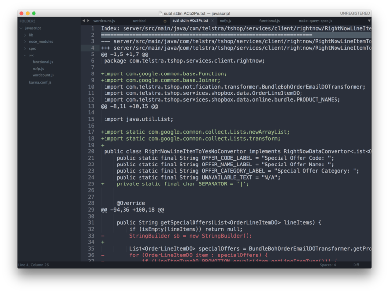

### Code Review

在`ThoughtWorks`，我们几乎每天都会进行一个叫`code review`或者`code diff`的活动：每天下午5:00，团队成员围坐在一起，将今天的修改大概过一下，这样做的好处非常明显：

1.	分享业务知识，了解彼此的工作
2.	分享技术细节，比如有人使用了某种设计模式
3.	帮助别人发现问题，比如逻辑错误等，群策群力


经过实践，`code reivew`可以快速发现问题，而且可以尽可能多的分享知识，是一种团队成员喜闻乐见的学习/娱乐形式。

但是随着项目的不同，各个团队使用的版本管理工具都不一样。用惯了`git`的非常漂亮的`diff`子命令之后，`svn`的`diff`简直就是战五渣。没有高亮，没有进度条，就是黑底白字的一些文本，实在无法让人提起兴趣。

这篇文章分享一个简单的方法，可以让你很容易的把`svn`的`diff`打造成一个漂亮的工具：


#### diff格式
Diff是一种通用的表示文本差异的格式，细节可以看我之前写过一篇[关于diff和patch的文章](http://icodeit.org/2012/02/diff%E5%92%8Cpatch%E7%9A%84%E4%BD%BF%E7%94%A8%E4%BB%8B%E7%BB%8D/)。需要说明的是，它作为一种标准格式，很多编辑器都提供对这种格式的高亮显示，比如现在非常流行的`Sublime Text`编辑器：



默认的，`svn`的diff命令会生成这样**朴素**的输出：


#### 命令行的diff高亮显示

在Mac下，可以通过`brew`来安装一个命令行工具，这个工具可以将`Diff`格式高亮显示：

```sh
$ brew install colordiff
```

有了这个工具，就可以将`svn`生成的`Diff`格式高亮显示出来：

```sh
$ svn diff | colordiff
```


但是你可能已经发现这些神奇的`^M`，这是`Windows`系统中的换行符在`Unix`类系统中的展示，我们需要将`Diff`先转换一次：

```sh
$ svn diff | dos2unix | colordiff
```


如果你的系统中没有`dos2unix`，可以用`brew`来安装：

```sh
$ brew install dos2unix unix2dos
```

#### 分页器
*nix系统下有两种分页器：`more`和`less`，`less`比`more`的功能更丰富。`less`有很多的参数，我们这里选用了3个常见的：

1.	`-s`: 压缩连续的空白行为一行
2.	`-M`: 给出更多的提示信息，包含行号，百分比等
3.	`+Gg`: 先跳至要查看文件的末尾，再跳至文件开头，这样从less就可以得到整个流的长度，从而计算出正确的百分比。当然如果是单独文件时，less是明确知道文件长度的，但是如果是从流中重定向过来的文本，less无法在开始时就得知长度。

下面这条命令可以将当前目录下的所有`html`文件分屏显示，并且在每一屏的最后一行显示百分比等信息：

```sh
$ cat *.html | less -s -M +Gg
```

#### 放在一起

好了，我们将每个部分都已经讲解了一遍了，现在让我们将这些零件串起来，在svn的`working copy`中执行这条命令就可以得到非常漂亮的，分页显示的Diff：

```sh
$ svn diff | dos2unix | colordiff | less -s -M +Gg
```

当然，还可以用一个`alias`(别名)来节省敲入的字符数：

```sh
$ alias sd='svn diff | dos2unix | colordiff | less -s -M +Gg'
```

这样你只需要在当前目录输入：

```sh
$ sd
```

即可启动这个pipeline了。