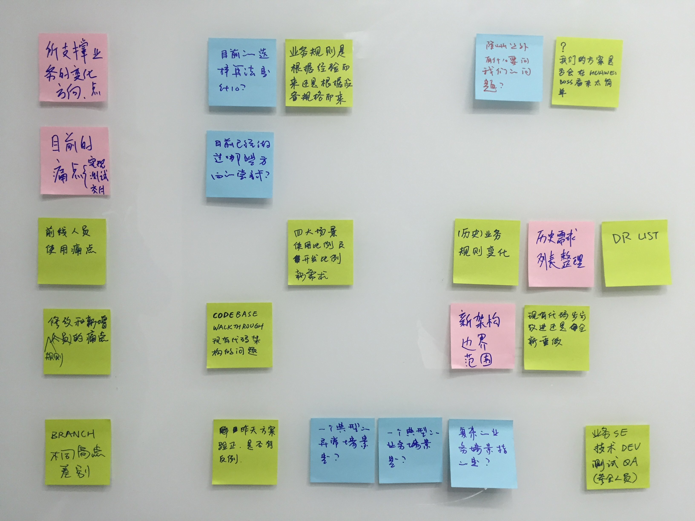

# 当我们谈论引导时，我们谈些什么？

## 什么是引导（facilitation）

引导（facilitation）的词根来源与拉丁语“facil”，意思是“让……更容易”。而负责引导的`引导师`（facilitator）的核心职责是，通过一系列的活动、技巧，保证引导会议顺畅的进行，并解决整个过程中的问题，使得参与者就问题产生一个共识，达成一个结论。

其中可能涉及很多具体的问题，比如几乎在每个会议中都可能看到的：

-  如果有人尝试将会议变成一言堂，如何处理？
-  如果参与者不愿意分享自己的观点，如何处理？
-  过程中，两个参与者产生了争执，如何处理？
-  如何把握节奏，刺激与会者发散？
-  如何在收集到足够信息后，进行收敛？

显然，这是一个技术活儿。一次好的引导可以将与会者的众多想法，信息聚合起来，形成对团队下一步要做什么有极强指导意义的`方案`。

## 日常的引导活动

在平时的工作中，我们其实已经在频繁的使用引导活动，但是很少有人将其作为体系来关注，也很少有人能将这个能力应用在其他方面（比如在客户现场咨询，或者参加售前等）。引导是如此的常见，以至于我们对其视而不见。比如在interview完成之后，所有面试官和HR一起做的well/less well的列举；各种社区活动（Open Party，CDConf等）之后的回顾；每个项目在一个迭代结束后的Retro；对于某个问题的头脑风暴等等。

### 项目回顾会议

在开始前，引导师需要保证团队：

-  每个人都有开发的态度
-  整个过程需要在一个足够安全的环境中进行（Safe Check）

有时候，有Team Lead在场，新人可能不愿意对某事（比如最近加班有点过分）发表自己的看法等。这时候需要有`Safe Check`，比如分为1到5档，大家用不记名投票的方式来表述自己是否觉得安全。如果投票结果显示大部分人都觉得不安全，则需要与会的人中，职位最高的那个人离开会议，然后再做一次`Safe Check`，直到大家都觉得足够安全。不过，对于已经进行过多轮回顾的团队，我们往往会忽略掉这一步。

Retro过程是，团队坐在一起，回顾上一个迭代（通常是两个星期）做过的事情，有哪些做的比较好，哪些有待改进，有哪些疑惑等等。Retro可以有很多的形式，比如简单的`Well/Less Well/Questions`，更聚焦在产生`Action`的海星式等等。

通常的顺序是：

1.  引导者请大家用纸笔将想法写在便签（stick）上
2.  Time box这个过程（通常是5分钟）
3.  大家将这些stick贴在墙上
4.  引导者和团队一起过一遍所有的stick
5.  归类相似的stick
6.  引导者促进团队交流，讨论stick上的问题，并形成一些改进点（Action）

Action一定要足够具体，并且需要一个所有者，`所有者`负责确保该`Action`一定会发生。比如团队发现上一个迭代中`Code review`做的不够好，一个`Action`就是每天下午5点有人来提醒大家来进行`Code review`。

如果这时候发现有太多的问题，团队可以用投票的方式选出本次Retro要讨论的数个stick。

### 引导会议

在日常工作中，我们几乎每天都有会议，而且越来越多的团队已经意识到冗长，无聊的会议有多大的杀伤力了。在很多会议上，与会者要么在刷新朋友圈，要么在对着笔记本电脑写代码或者读新闻，即使强制要求不许带电脑和手机的情况下，也无法限制参加者神游太虚。

根据《引导的秘诀》这本书里的定义，引导会议是

	引导会议是一个高度结构化的会议，会议中的领导者（引导者）引导参会人通过预先设定好的步骤达成所有参会人产生，理解并接受的结果。

引导会议需要充分调用参与者的积极性，每个人都需要足够聚焦，这要求引导者可以有能力使得团队振奋（比如幽默的风格，或者具有挑战性的问题等）。另外，每个人的idea都需要被充分重视（一个细节就是不要随意篡改你听到的内容，这是没有经验的引导者常犯的错误之一）。一旦所有参与者都积极起来，引导者就可以稍微退后一些，将舞台交给团队。

而有时候，情景则相反，大家都不发言，也没有看到明显的发言的趋势，这时候需要一些方法来激励。如果是团队都比较茫然，引导者需要列出一些简单而容易理解的步骤，帮助团队按照预设的节奏来逐步前进。比如，在一开始的时候就将agenda板书在墙上，并通过头脑风暴的方式，鼓励参与者来将自己的idea可视化出来。

一个典型的误区是，引导会议的最后结论是本来就存在与引导者脑海中的想法。如果仅从结果来看，这种情况可能发生，但是只能说是碰巧而已。一个好的引导者需要帮助与会者自己产生，并得出一个可行的，被广泛认可的方案，而不是强加一个自己的给团队。

我们最为专业的引导活动是UX团队在客户现场的`inception`，`inception`由一系列相互关联，环环相扣的工作坊组成，这些工作坊基本上都需要采用很多引导的技巧，帮助客户团队将自己的问题描述清楚，并形成一个所有参与者都达成一直的可行方案。

如果你不知道如何开始一个引导会议，一个简单而通用的模式是：

1.  我们的现状是
1.  我们的目标是
1.  我们如何到达目标
1.  在行进中，如何度量

《引导的秘诀》里还提到了一种`5P`模式：目的(Purpose)，产出(Product)，与会人(Participant)，可能的问题(Probable issues)以及流程(Process)。

5P提示你在准备会议之前，需要尝试回答这几个问题

-  为什么要开这次会议？主要目的是什么？
-  会议后的产出是什么？
-  谁需要参与会议？
-  在会议中，我们可能遇到什么问题？
-  遇到这些问题是，我们如何解决？

## 引导中的常用技巧

在引导活动中，有一些基本的规则，可以保证引导会议的顺畅性，比如

-  引导师需要有足够的权威（可以打断那些长篇大论，保证过程的流畅）
-  如果人数太多，可以使用token（比如一个玩具考拉，或者一个澳式橄榄球，只有持有token的人可以说话）
-  保持one conversation（不要交头接耳）
-  每张stick上只写一条问题/想法

引导师必须有控制会话何时结束的能力，否则引导活动将会变成一发不可收拾的冗长会议。坚持`one conversation`可以保证参与者足够聚焦，也保证所有人都在同一个频道上。如果发现有交头接耳的，引导者可以直接打断并提醒之。

每张便签上只写一条想法，首先可以保证多样性，便于讨论，也便于后续的分类。另外，简洁的描述在一定程度上可以促进与会者进行讨论，而一个冗长的描述则会让人丧失兴趣。

另外还有一些比较基础的技巧：

-  所有讨论都应该对事不对人（特别是一些负面的总结）
-  如果有人提出与议题并不特别相关，但是又特别重要的点时，可以将这些点记下来（不要轻易打击发言者的积极性）
-  不定时的总结，以确保参与者都在同一频道，并且有助于大家对进度的了解（是不是快结束了）
