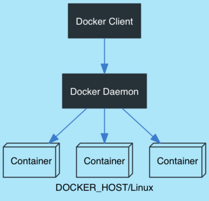
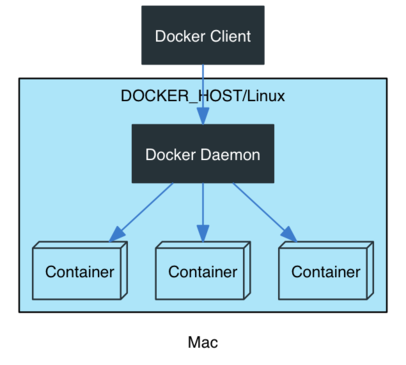
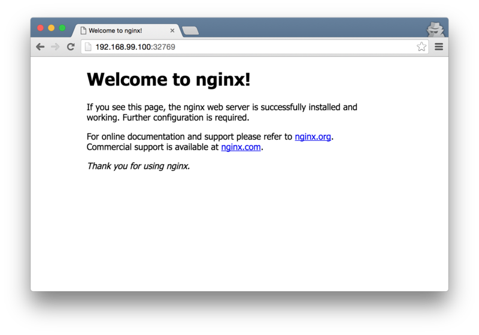

## 容器技术与Docker

和`微服务`一起火起来的，还有容器技术。通过容器技术，应用程序可以和环境打包在一个包中，然后运行在任何支持容器的操作系统中，容器隔离了所有的物理层。这使得人们非常轻量级地、安全可靠地发布软件包（包含了应用程序和运行时环境）。

传统意义上，人们在持续发布流水线上编译，测试，构建出一个软件包，然后再自动化配置一套环境，再将软件部署其上。现在人们可以很容易的为流水线添加一个新的job，使其构建出一个独立的容器。这个容器可以直接运行在像AWS这样的云提供商的机器上。

Docker是目前最为流行的容器技术，它可以运行在主流的Linux主机上（内核版本3.10以上）。通过Docker Toolbox，你还可以在Mac下，甚至Windows上运行Docker（当然，只是Docker的客户端，但是即使这样也可以获得Docker带来的好处）。

如果你在`Mac`下工作（如果在Linux下工作，按照官方的指导即可，如果在Windows下工作，那我建议你还是换成Linux或者Mac吧），可以安装`Docker Toolbox`来使用Docker。`Docker Toolbox`中包含了一组工具，包括：

-  docker-machine 应用程序
-  docker-compose 应用程序
-  Kitematic，docker的图形化客户端
-  VirtualBox
-  一个包含了Docker所需配置的shell环境

### 概念

事实上，我们通常说的Docker分为三个部分：

-  docker daemon（只能运行在Linux下，使用了Linux的一些内核特性）
-  docker client（客户端程序，可以运行在Linux/Mac/Windows下）
-  container（容器，包含了应用程序和其依赖的环境）

在Linux环境中，这三者都在同一个环境中：



而在Mac和Windows中，docker client运行在宿主环境中，docker daemon和container都在一个Linux的虚拟机中：



### docker-machine

`docker-machine`可以用来创建和管理Linux虚拟机，这些Linux虚拟机具备了运行Docker Daemon的条件。宿主操作系统的客户端可以连接到该Linux虚拟机。

你可以使用下面的命令来创建一个虚拟机：

```sh
$ docker-machine create --driver virtualbox myvm
```

使用：

```sh
$ docker-machine ls
```

来查看已经运行的`docker`虚拟机：

```sh
$ docker-machine ls
NAME   ACTIVE   DRIVER       STATE     URL                         SWARM
dev             virtualbox   Running   tcp://192.168.99.100:2376
```

可以看到，我本地有一台名为`dev`的虚拟机，状态为`运行中`。如果这个机器没有启动（STATE状态部位Running），你可以通过：

```sh
$ docker-machine start dev
```

来启动它。启动之后，你可以使用`env`子命令来查看机器的配置

```sh
$ docker-machine env dev
export DOCKER_TLS_VERIFY="1"
export DOCKER_HOST="tcp://192.168.99.100:2376"
export DOCKER_CERT_PATH="/Users/jtqiu/.docker/machine/machines/dev"
export DOCKER_MACHINE_NAME="dev"
# Run this command to configure your shell: 
# eval "$(docker-machine env dev)"
```

事实上，你可以创建多个`docker`虚拟机，因此在你的shell中执行下列命令来设置环境变量：

```sh
eval "$(docker-machine env dev)"
```

这样，你本地的环境变量如`DOCKER_HOST`，`DOCKER_MACHINE_NAME`等就会被设置为虚拟机`dev`对应的值，后续的所有docker客户端命令就会在该机器上生效。

启动了`docker`虚拟机之后，你就可以使用`docker`客户端程序来启动container了

```sh
$ docker run -d -P --name web nginx
```

这条命令会使用`nginx`这个docker image来启动一个容器，容器的名字叫`web`。默认的docker在执行完命令之后会退出，`-d`选项使其进入后台服务模式，即不退出。`-P`选项会将容器中的端口暴露给宿主环境。

如果你本地没有`nginx`镜像，docker会尝试从远程的中心仓库下载该镜像，最后启动：

```sh
$ docker run -d -P --name web nginx
Unable to find image 'nginx:latest' locally
Pulling repository docker.io/library/nginx
c0e6aba9c87a: Pulling dependent layers 
...
```

启动之后，你就可以通过`DOCKER_HOST`对应机器的80端口来访问该nginx实例了：



### docker-compose

