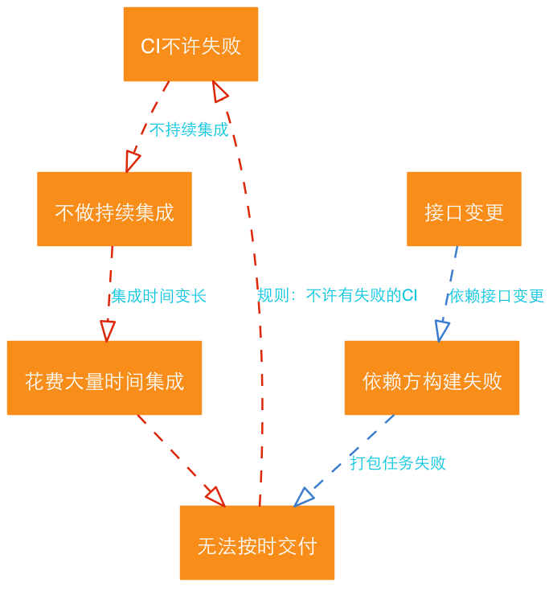

## 积沙成塔

>你在展望未来的时候，是不可能将这些片段完整的串起来的，你只能在回顾过往时才可以。所以你要相信，在未来某个时刻，你会将这些片段串起来！

>史蒂夫.乔布斯

当我读完[《程序员的思维修炼》](https://book.douban.com/subject/5372651/)时，有一种韦小宝和双儿终于八部《四十二章》中的地图串起来的感觉。那些原本琐碎，散落的片段开始汇集，并形成一条明晰的线。很多原来遇到的问题和困惑也都变得清明而鲜活。

不要理解错了，我可不是说这本书本身有那么大的功效。事实上，这种非常美妙的体验与之前的一些阅读有很大的关系，这段时间我在读/重读的一些书是：

-  [《发布！软件的设计与部署》](https://book.douban.com/subject/26304417/)
-  [《反脆弱》](https://book.douban.com/subject/24838618/)
-  [《系统思考》](https://book.douban.com/subject/25963524/)
-  [《第五项修炼》](https://book.douban.com/subject/4051739/)
-  [《精益开发实战》](https://book.douban.com/subject/11620809/)
-  [《持续交付》](https://book.douban.com/subject/6862062/)
-  [《凤凰项目：一个IT运维的传奇故事》](https://book.douban.com/subject/26644070/)
-  [《认知与设计》](https://book.douban.com/subject/6792322/)

不知道为什么，原标题为《Pragmatic Thinking and Learning》的书，为什么会被翻译为《程序员的思维修炼》，整本书也基本上没有什么程序员，软件开发相关的内容。两年前我读了几页就放下了，我以为又是一本《从小工到专家》，《Clean Coder》之类的书。

## 核心观念

事实上，《程序员的思维修炼》里在讨论从大脑以及人类思维的方式。它强调使用一些实践来提升大脑的工作效率，包括如何平衡使用R(Rich)型思维和L(Linear)型思维（不是简单的左右脑思维，人类的神经系统比简单的左右脑半球可要复杂的多了）。

其中为了锻炼R型（基于图像而非语言，整体而非局部，感觉而非理性）的思维，作者建议做一些编程、写作之外的练习。

比如我经常做的有：

-  练习某种武术（比如形意拳）
-  绘画（素描，练习手眼配合）
-  把想到的东西说出来
-  听相声（在听相声的过程中，你会不自觉的脑部画面）

这些看似与思维方式，具体的编码能力没有关系的事情，其实会在很大程度上帮助你成为更加优秀的`问题解决者`。

在实际工作中，我们会遇到很多问题。这些问题在最开始时我们可能只是全盘接受，而没有产生深层次的思考。

比如为什么要结对编程？持续集成/持续交付到底要做到什么程度？如果项目压力很大的话，还要坚持编写自动化测试吗？如果客户的组织结构限制，要裁剪掉一些实践，如何做平衡？

### 一个部门墙的例子

我去年在客户现场做一个项目的售前，在帮助客户梳理需求的时候，遇到一个在我看来十分奇怪的需求：客户的开发经理想要开发一个`接口管控`系统。

客户团队在开发过程中感觉很痛苦：正在开发的业务系统分为很多个组件，每个组件都由一个独立的团队开发，所有的组件会定期的做集成。在集成的时候（好几周一次），经常会有某些接口更改之后导致依赖方编译失败的情况。也就是说，接口的变更很难控制，依赖方基于旧版本的接口进行开发，到集成的时候发现两者的不匹配，由于没有人知道接口变更对其他人的影响，排查问题会花费很长时间。

而好几周一次的集成，往往以为着开发时间的结束，软件要进入测试部门的验收测试。测试部门要验收，又没有一个可用的版本，所有压力就会跑到开发部门，而这个排查过程又很费时，以为着有人需要加班工作，所以大家对接口变更深恶痛绝。

在这个背景下，客户经理想要一个`接口管控`系统来保证所有的接口定义（C语言的头文件，或者Java里的接口）都**不能**被自由的变更，这样集成的时候就不会有问题了。而如果是在一定要修改的时候，通过这个管控系统，开发经理可以知道谁，想要在何时，发起什么样的变更，而影响的依赖方有哪些等等信息。以后还可以对这些变更进行统计，分析哪些接口是多变而不稳定的。

如果忽视这个需求背后的**不合理**的本质，开发者很可能会真的建模出一个表示`接口`的实体，然后开发一个信息管理系统来管理这些实体，还可能为其开发`dashboard`用以展现接口的变更分析等。

我看了看客户团队搭建的jenkins的监视器，问他：你们不是有持续集成环境吗，为什么不把所有的组件的集成都放在CI上运行呢？客户像看疯子一样的看着我，说：这些组件是别的部门开发的啊！

我说，哪又怎么样呢？虽然不是同一个部门，但是发布的时候总是在一起的，放在统一的持续集成环境可以保证变更的影响最小化：毕竟，本质上CI的作用就是通过频繁的集成来尽早的暴露问题嘛。客户摇摇头，说：版本的CI是不能失败的！我几乎要笑出声来了，说：那要CI干什么，如果它永远不挂的话！客户说：这个是一条开发纪律，版本CI失败了会影响团队的绩效。

也就是说，从某个时刻起，开发部经理被客户逼迫着上线，但由于产品的集成问题，该交付的软件并没有如期交付（当然也没有经过足够的测试）-- 因为没有一个可用的软件包。于是气急败坏的经理在总结经验的时候定下规矩：版本CI不许失败！

这是一个局部优化的典型案例。



### 全局优化

在遇到问题时，人们总是倾向于解决眼前的问题。而这很可能是“头痛医头，脚痛医脚”的手段，如果缺乏对问题根本原因的分析过程，重复的问题会不断的冒出来，你会为解决这些救火型的而疲于奔命。就像《凤凰项目》中比尔的运维团队一样，团队成员总是被临时插入的紧急任务打断，而一旦团队将次作为常态，就再也无法从这种没有希望的状态中解脱出来了。团队会变得越来越忙，越来越没有条理。

全局优化强调分析问题的根本原因，从而更加系统的进行调整，而不是做无谓的局部优化。

### 关注价值流

关于这一点，我事实上已经整理了好几篇博客了：

-  [如何持久化你的项目经历](http://icodeit.org/2016/01/how-to-summarize-privious-project/)
-  [不想当UX的开发不是好咨询师](http://icodeit.org/2016/01/for-those-dev-who-doesnt-want-to-be-a-ux-cannot-be-a-good-consulant/)

很多时候，程序员很容易深陷技术无法自拔，而忽略了技术服务于业务这个前提。我自己在工作的前几年也是这样，喜欢追求`纯粹`的技术。业务本身可能并不会比技术更有意思，但是使用技术来解决业务中遇到的问题，才是程序员重要的职责。

当然，这种短视并不局限在程序员身上。我看到了很多的趾高气昂的业务人员，对开发人员说：我不管你实现上的细节，只需要你能让我完成X功能和Y功能就行了；也见过抱怨开发自己不自测，把压力push到测试团队的测试人员。

其实，如果将目光放到`价值流`上，这种短视行为就可能得到改善。每个独立的步骤：业务分析，编码实现，测试等都无法带来实际的价值，唯有这个流程串起来才可以。如果团队（包含了业务分析，开发，测试，部署）都聚焦在`价值流`上，才可能实现全局上的优化行为。

### 在现实中验证和优化

《发布》告诉我们现实世界是多么的混乱和不可控，我们认为的那些小概率事件其实每天都在发生。粗心的程序员写错了日志级别，结果网站上线之后的几天内日志就写满了磁盘；一个未赋值的环境变量导致使用了该变量的脚本执行了危险的操作（`rm -rf $PREFIX/`）；没有为数据库连接设置合适的超时时间而导致系统挂起等等。

这些在开发环境，测试环境，staging环境无法发现的问题，最终会在产品环境中找到你，并对你的数据造成伤害，令你的业务造成损失。

我在很早前的一个项目上，经历过这样一个`有趣`的生产问题，直到今天我还记忆犹新。我为一个C/S架构的文件管理系统设计了一个表结构，由于我们是用C语言来实现这个系统的，所以不得不定义了一些这样的结构体：

```c
typedef struct _RemoteFile{
	char name[128];
	char revision[6];
	//...
} RemoteFile;
```

基于某些原因（可能是序列化库的限制），这里的版本号定义成了一个字符数组，长度为6。这个字段会保存后台的`subversion`返回的版本号。

在投入生产之前，开发和测试人员分别做了大量的测试（好吧，并不是很大量，但是确实做了一些测试）。基本功能都正常，事实上，这个系统良好的运行了3周，第4周的某一天，客户突然抱怨所有文件都无法提交到后台系统了。

VC写的前端应用会报一个类似于`Something Went Wrong`的错误，我们远程查看了后台的日志，发现数据库报了一个`主键冲突`的异常。有经过了1个小时的分析（其实就是远程连接到生产系统，用gdb attach到进行上，然后单步调试），我们发现`RemoteFile`这个结构提的`revision`中的数据赫然是`999999`！。

我们后台的文件管理系统是基于`subversion`开发的，而同一个`subversion`库会共享一个`revision`号：这显然是一个不断自增的数字。在短短的3周内，疯狂的用户们提交了`999999`次，终于在第`1000000`次时保存失败了：事实上，subversion已经执行成功了，但是写入数据库时失败了。

#### 反脆弱

如果没有办法避免这种失败（事先要考虑到这么多的异常情况不太现实，而且会投入过多的精力），那么就需要设计某种机制，使得当发生这种失败时系统可以将损失降低到最小。

另一方面，系统需要具备从灾难中回复的能力。如果由于某种原因，服务进程意外终止了，那么一个`watchdog`机制就会非常有用。
