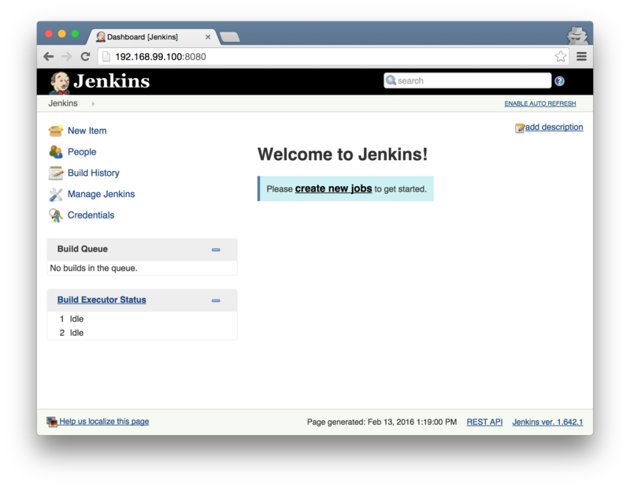
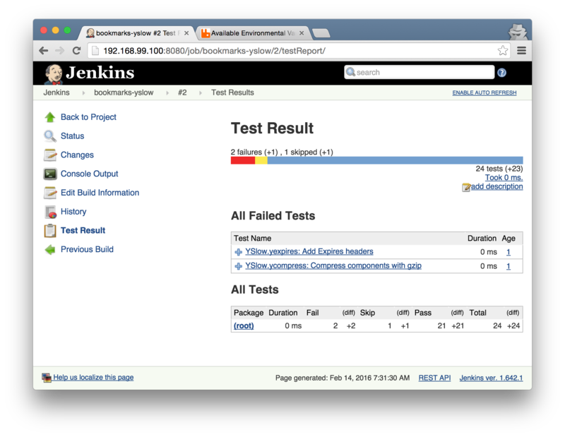

## Web站点的响应速度

雅虎在2006年就发布了一份提升Web站点响应速度的[最佳实践指南](https://developer.yahoo.com/performance/rules.html)。该指南包含了35条规则，分为7个类别。这些规则已经被广泛使用，并指导人们在新的站点设计时更好的考虑问题。

[YSlow](http://yslow.org/)是一个基于雅虎的这份指南的工具，它可以测试一个站点是否“慢”，以及为什么“慢”？你可以通过很多方式来使用[YSlow](http://yslow.org/)，比如Firefox，Chrome的插件，命令行工具，甚至PhantomJS这样的无头（Headless）浏览器。

我们这里讨论如何在持续集成服务器上设置一个YSlow任务，这个任务会在每次构建之后，测试你应用的性能指标，以帮助你更快的发现和定位问题。当然，我推荐你在`staging`环境，很多开发者在测试环境，本地开发环境都会启动很多对`Debug`友好的设置，比如未压缩的JS/CSS，没有超时设置的响应等，这会导致该任务的`打分`不够准确。

### 搭建CI环境

按照传统讨论，我们需要至少做这样一些事情：

-  安装JDK
-  安装Jenkins
-  安装[PhantomJS](http://phantomjs.org/)
-  安装[YSlow.js脚本](http://yslow.org/phantomjs/)

然后设置环境变量，在Jenkins上创建任务，并运行YSlow.js脚本。这个任务很简单，只需要设置好参数，然后将结果输出为Jenkins上的报告即可。比如：

```sh
$ phantomjs /var/share/yslow.js -i grade -threshold "B" -f junit \
http://bookmarks-frontend.s3-website-us-west-2.amazonaws.com/ > yslow.xml
```

-  `-i grade` 展示打分（grade）信息（还可以是basic/stats/all）等
-  `-threshold "B"` 指定失败的阈值为B
-  `-f junit` 输出为`junit`识别的XML格式

这里的阈值可以是数字（0-100分），字母（A-F级别）或者一个JSON字符串（混合使用）

```sh
-threshold '{"overall": "B", "ycdn": "F", "yexpires": 85}'
```

上面的命令会测试站点`http://bookmarks-frontend.s3-website-us-west-2.amazonaws.com/`的各项指标，并应用雅虎的那35条规则，并最终生成一个`junit`测试报告格式的文件：`yslow.xml`。

但是维护CI环境是一个比较麻烦的事情，而且既然每个项目都可能会用到这样的`基础设施`，一种好的做法就是将其做成一个`镜像`，这样就可以很容易复用了！这里我们使用docker来安装和配置我们的CI环境，配置完成之后，

### 基于docker/docker-compose的环境搭建

在`docker`出新之前，我们要搭建一个`测试`或者`staging`环境，需要很多个不同角色的机器：有专门的数据库服务器，文件服务器，缓存服务器，Web服务器，反向代理等等。这样在成本上显然是个不小的开销，如果将所有不同的组件部署在同一台机器上，则又可能互相干扰，只需要一个小小的失误，整个系统就需要重新配置。更可怕的是，这个环境和生产系统不一致，那么很可能真实的错误要等到系统上线之后才会被发现。

2012年，我在一个项目上，系统采用非常传统的J2EE架构。本地开发中，我们使用了Jetty作为容器，而`Staging`使用了Tomcat。Tomcat对空格的处理和Jetty有所不同，我们本地测试通过的代码，在`Staging`完全不能工作。

`docker`出现之后，我们可以在一台物理机器上运行多个互不干涉的容器，每个容器可以是一个组件（比如运行数据库的容器，Web服务器容器等等）。但是对多个容器的管理又是一个很麻烦的事情，`docker`提供了`docker-compose`工具来解决这个问题。使用`docker-compose`可以定义一组互相独立，但是又可以协作在一起的容器，这样我们可以很容易的搭建一个真实的环境。

比如我们可以定义个`docker-compse.yml`

```yml
app:
  build: .
  links:
    - db:postgres
  ports:
    - 8000:8000
  volumes:
    - .:/app
  working_dir: /app
  entrypoint: /app/start.sh
  environment:
    JDBC_DATABASE_URL: jdbc:postgresql://postgres:5432/bookmarks
    DATABASE_USER: bookmarks-user
    DATABASE_PASS: bookmarks-password

db:
  image: postgres:9.3
  ports:
    - 5432:5432
  environment:
    POSTGRES_DB: bookmarks
    POSTGRES_USER: bookmarks-user
    POSTGRES_PASSWORD: bookmarks-password
```

这个`docker-compose`定义了两个组件，`app`和`db`。`db`使用了`postgres:9.3`镜像，并设置了自己的环境变量。`app`则从当前目录`.`构建一个新的镜像，`app`与`db`通过`links`属性连接起来。

如果在当前目录执行`docker-compose build`命令，`docker-compose`会找到本地的`Dockerfile`，然后构建出一个`docker`的镜像，并启动该容器，同时，它还会启动`postgres:9.3`容器作为数据库组件。这样我们的环境就被完整的搭建好了。

#### 搭建CI环境

```yml
app:
  build: .
  ports:
    - 8080:8080
    - 50000:50000
  volumes:
    - ./data:/var/jenkins_home
```

这个配置，表明我们会根据当前目录的`Dockerfile`来构建一个镜像。

通过命令`volumns`，我们将本地目录`./data`映射为`jenkins_home`，这样我们定义的job信息，以及插件的安装都会放到本地的目录中，方便管理。配置完成之后，构建并启动该容器：

```sh
FROM jenkins:latest

# Env
ENV PHANTOMJS_VERSION 1.9.6
ENV PHANTOMJS_YSLOW_VERSION 3.1.8
ENV SHARE_BIN /var/share

# Install stuff by using root
USER root
RUN apt-get update
RUN apt-get upgrade -y
RUN apt-get install -y git wget libfreetype6 libfontconfig bzip2

RUN mkdir -p $SHARE_BIN

RUN wget -q --no-check-certificate -O /tmp/phantomjs-$PHANTOMJS_VERSION-linux-x86_64.tar.bz2 \
https://bitbucket.org/ariya/phantomjs/downloads/phantomjs-$PHANTOMJS_VERSION-linux-x86_64.tar.bz2
RUN tar -xjf /tmp/phantomjs-$PHANTOMJS_VERSION-linux-x86_64.tar.bz2 -C /tmp
RUN rm -f /tmp/phantomjs-$PHANTOMJS_VERSION-linux-x86_64.tar.bz2
RUN mv /tmp/phantomjs-$PHANTOMJS_VERSION-linux-x86_64/ $SHARE_BIN/phantomjs
RUN ln -s $SHARE_BIN/phantomjs/bin/phantomjs /usr/bin/phantomjs

RUN wget -q --no-check-certificate -O /tmp/yslow-phantomjs-$PHANTOMJS_YSLOW_VERSION.zip \
http://yslow.org/yslow-phantomjs-$PHANTOMJS_YSLOW_VERSION.zip
RUN unzip /tmp/yslow-phantomjs-$PHANTOMJS_YSLOW_VERSION.zip -d $SHARE_BIN/
USER jenkins
```

执行下面的命令来设置并启动CI服务器：

```sh
docker-compose up
```



创建新任务，并指定该任务执行的命令为：

```sh
$ phantomjs /var/share/yslow.js -i grade -threshold "B" -f junit \
http://bookmarks-frontend.s3-website-us-west-2.amazonaws.com/ > yslow.xml
```

由于此时`phantomjs`已经被安装到了容器中，我们可以直接在jenkins中使用。运行结束之后，这个命令会生成一个报告：



-  没有压缩内容
-  没有添加过期的头信息

在产品环境，我们需要使用反向代理来添加这些头信息，以保证最终用户在使用Web站点时的体验。