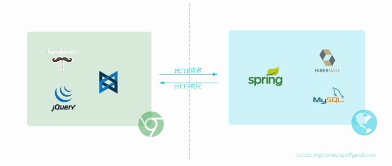
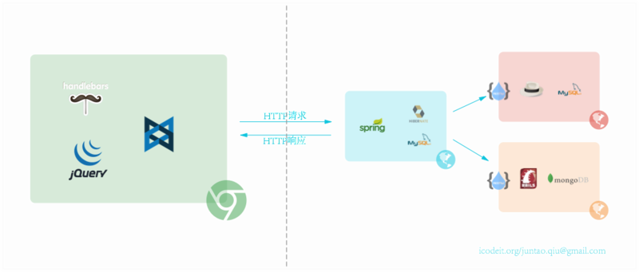
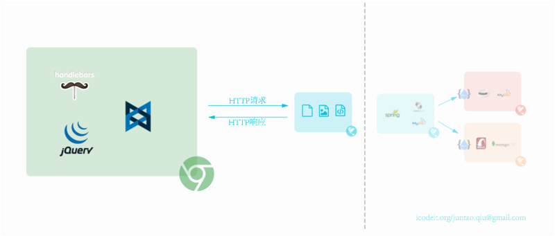
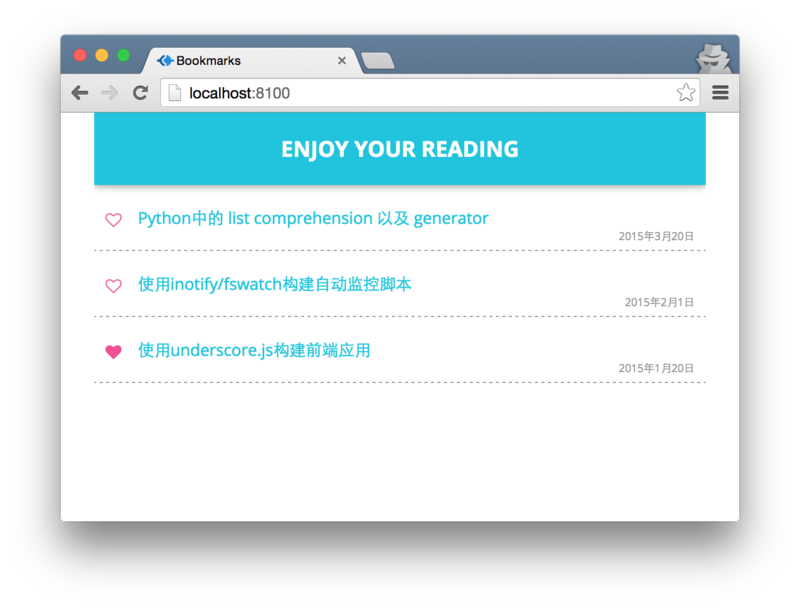
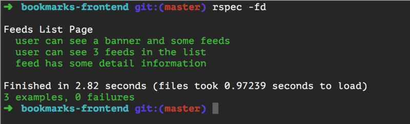

## 前后端分离

前后端分离已经是业界所共识的一种开发/部署模式了。所谓的前后端分离，并**不是**传统行业中的按部门划分，一部分人纯做前端（HTML/CSS/JavaScript/Flex），另一部分人纯做后端，因为这种方式是**不工作**的：比如很多团队采取了后端的模板技术（JSP, FreeMarker, ERB等等），前端的开发和调试需要一个后台Web容器的支持，从而无法做到真正的分离（更不用提在部署的时候，由于动态内容和静态内容混在一起，当设计动态静态分流的时候，处理起来非常麻烦）。关于前后端开发的另一个讨论可以[参考这里](http://icodeit.org/2015/06/do-we-really-short-for-front-end-developer/)。

即使通过API来解耦前端和后端开发过程，前后端通过`RESTful`的接口来通信，前端的静态内容和后端的动态计算分别开发，分别部署，**集成**仍然是一个绕不开的问题 --- 前端/后端的应用都可以独立的运行，但是集成起来却不工作。我们需要花费大量的精力来调试，直到上线前仍然没有人有信心所有的接口都是工作的。

### 一点背景

一个典型的Web应用的布局看起来是这样的：



前后端都各自有自己的开发流程，构建工具，测试集合等等。前后端仅仅通过接口来编程，这个接口可能是JSON格式的RESTFul的接口，也可能是XML的，重点是后台只负责数据的提供和计算，而完全不处理展现。而前端则负责拿到数据，组织数据并展现的工作。这样结构清晰，关注点分离，前后端会变得相对独立并松耦合。

上述的场景还是比较理想，我们事实上在实际环境中会有非常复杂的场景，比如异构的网络，异构的操作系统等等:



在实际的场景中，后端可能还会更复杂，比如用C语言做数据采集，然后通过Java整合到一个数据仓库，然后该数据仓库又有一层Web Service，最后若干个这样的Web Service又被一个Ruby的聚合Service整合在一起返回给前端。在这样一个复杂的系统中，后台任意端点的失败都可能阻塞前端的开发流程，因此我们会采用mock的方式来解决这个问题：



这个`mock`服务器可以启动一个简单的HTTP服务器，然后将一些静态的内容serve出来，以供前端代码使用。这样的好处很多:

1.  前后端开发相对独立
1.  后端的进度不会影响前端开发
1.  启动速度更快
1.  前后端都可以使用自己熟悉的技术栈（让前端的学maven，让后端的用gulp都会很不顺手）

但是当**集成**依然是一个令人头疼的难题。我们往往在集成的时候才发现，本来协商的数据结构变了：`deliveryAddress`字段本来是一个字符串，现在变成数组了（业务发生了变更，系统现在可以支持多个快递地址）；`price`字段变成字符串，协商的时候是`number`；用户邮箱地址多了一个层级等等。这些变动在所难免，而且时有发生，这会花费大量的调试时间和集成时间，更别提修改之后的回归测试了。

所以仅仅使用一个静态服务器，然后提供`mock`数据是远远不够的。我们需要的`mock`应该还能做到：

1.  前端依赖指定格式的mock数据来进行UI开发
1.  前端的开发和**测试**都基于这些mock数据
1.  后端产生指定格式的mock数据
1.  后端需要测试来确保生成的mock数据正是前端需要的

简而言之，我们需要商定一些契约，并将这些契约作为**可以被测试**的中间格式。然后前后端都需要有测试来使用这些契约。一旦契约发生变化，则另一方的测试会失败，这样就会驱动双方协商，并降低集成时的浪费。

一个实际的场景是：前端发现已有的某个契约中，缺少了一个`address`的字段，于是就在契约中添加了该字段。然后在UI上将这个字段正确的展现了（当然还设置了字体，字号，颜色等等）。但是后台生成该契约的服务并没有感知到这一变化，当运行生成契约部分测试（后台）时，测试会失败了 --- 因为它并没有生成这个字段。于是后端工程师就找前端来商量，了解业务逻辑之后，他会修改代码，并保证测试通过。这样，当集成的时候，就不会出现UI上少了一个字段，但是谁也不知道是前端问题，后端问题，还是数据库问题等。

而且实际的项目中，往往都是多个页面，多个API，多个版本，多个团队同时进行开发，这样的契约会降低非常多的调试时间，使得集成相对平滑。

在实践中，契约可以定义为一个JSON文件，或者一个XML的payload。只需要保证前后端**共享同一个契约集合**来做测试，那么集成工作就会从中受益。一个最简单的形式是：提供一些静态的`mock`文件，而前端所有发往后台的请求都被某种机制拦截，并转换成对该静态资源的请求。

1.  [moco](https://github.com/dreamhead/moco)，基于Java
1.  [wiremock](http://wiremock.org/index.html)，基于Java
1.  [sinatra](http://www.sinatrarb.com/)，基于Ruby

看到`sinatra`被列在这里，可能熟悉`Ruby`的人会反对：它可是一个`后端`全功能的的程序库啊。之所以列它在这里，是因为`sinatra`提供了一套简洁优美的`DSL`，这个`DSL`非常契合`Web`语言，我找不到更漂亮的方式来使得这个`mock server`更加易读，所以就采用了它。

### 一个例子

我们以这个应用为示例，来说明如何在前后端分离之后，保证代码的质量，并降低集成的成本。这个应用场景很简单：所有人都可以看到一个条目列表，每个登陆用户都可以选择自己喜欢的条目，并为之加星。加星之后的条目会保存到用户自己的`个人中心`中。用户界面看起来是这样的：



不过为了专注在我们的中心上，我去掉了诸如登陆，个人中心之类的页面，假设你是一个已登录用户，然后我们来看看如何编写测试。

#### 前端开发

根据通常的做法，前后端分离之后，我们很容易`mock`一些数据来自己测试：

```json
[
    {
        "id": 1,
        "url": "http://abruzzi.github.com/2015/03/list-comprehension-in-python/",
        "title": "Python中的 list comprehension 以及 generator",
        "publicDate": "2015年3月20日"
    },
    {
        "id": 2,
        "url": "http://abruzzi.github.com/2015/03/build-monitor-script-based-on-inotify/",
        "title": "使用inotify/fswatch构建自动监控脚本",
        "publicDate": "2015年2月1日"
    },
    {
        "id": 3,
        "url": "http://abruzzi.github.com/2015/02/build-sample-application-by-using-underscore-and-jquery/",
        "title": "使用underscore.js构建前端应用",
        "publicDate": "2015年1月20日"
    }
]
```

然后，一个可能的方式是通过请求这个json来测试前台：

```js
$(function() {
	$.get('/mocks/feeds.json').then(function(feeds) {
		var feedList = new Backbone.Collection(extended);
		var feedListView = new FeedListView(feedList);

		$('.container').append(feedListView.render());
	});
});
```

这样当然是可以工作的，但是这里发送请求的`url`并不是最终的，当集成的时候我们又需要修改为真实的`url`。一个简单的做法是使用`Sinatra`来做一次`url`的转换：

```rb
get '/api/feeds' do
	content_type 'application/json'
	File.open('mocks/feeds.json').read
end
```

这样，当我们和实际的服务进行集成时，只需要连接到那个服务器就可以了。

注意，我们现在的核心是`mocks/feeds.json`这个文件。这个文件现在的角色就是一个契约，至少对于前端来说是这样的。紧接着，我们的应用需要渲染`加星`的功能，这就需要另外一个契约：找出当前用户加星过的所有条目，因此我们加入了一个新的契约：

```json
[
    {
        "id": 3,
        "url": "http://abruzzi.github.com/2015/02/build-sample-application-by-using-underscore-and-jquery/",
        "title": "使用underscore.js构建前端应用",
        "publicDate": "2015年1月20日"
    }
]
```

然后在`sinatra`中加入一个新的映射：

```rb
get '/api/fav-feeds/:id' do
	content_type 'application/json'
	File.open('mocks/fav-feeds.json').read
end
```

通过这两个请求，我们会得到两个列表，然后根据这两个列表的交集来绘制出所有的星号的状态（有的是空心，有的是实心）：

```js
$.when(feeds, favorite).then(function(feeds, favorite) {
    var ids = _.pluck(favorite[0], 'id');
    var extended = _.map(feeds[0], function(feed) {
        return _.extend(feed, {status: _.includes(ids, feed.id)});
    });

    var feedList = new Backbone.Collection(extended);
    var feedListView = new FeedListView(feedList);

    $('.container').append(feedListView.render());
});
```

剩下的一个问题是当点击红心时，我们需要发请求给后端，然后更新红心的状态：

```js
toggleFavorite: function(event) {
    event.preventDefault();
    var that = this;
    $.post('/api/feeds/'+this.model.get('id')).done(function(){
        var status = that.model.get('status');
        that.model.set('status', !status);
    });
}
```

这里又多出来一个请求，不过使用Sinatra我们还是可以很容易的支持它：

```rb
post '/api/feeds/:id' do
end
```

可以看到，在没有后端的情况下，我们一切都进展顺利 --- 后端甚至还没有开始做，或者正在由一个进度比我们慢的团队在开发，不过无所谓，他们不会影响我们的。

不仅如此，当我们写完前端的代码之后，可以做一个`End2End`的测试。由于使用了mock数据，免去了数据库和网络的耗时，这个`End2End`的测试会运行的非常快，并且它确实起到了端到端的作用。这些测试在最后的集成时，还可以用来当UI测试来运行。所谓一举多得。

```rb
#encoding: utf-8
require 'spec_helper'

describe 'Feeds List Page' do
	let(:list_page) {FeedListPage.new}

	before do
		list_page.load
	end

	it 'user can see a banner and some feeds' do
		expect(list_page).to have_banner
		expect(list_page).to have_feeds
	end

	it 'user can see 3 feeds in the list' do
		expect(list_page.all_feeds).to have_feed_items count: 3
	end

	it 'feed has some detail information' do
		first = list_page.all_feeds.feed_items.first
		expect(first.title).to eql("Python中的 list comprehension 以及 generator")
	end
end
```



关于如何编写这样的测试，可以参考之前写的[这篇文章](http://icodeit.org/2015/01/page-object-with-site-prism/)。

#### 后端开发

我在这个示例中，后端采用了`spring-boot`作为示例，你应该可以很容易将类似的思路应用到Ruby或者其他语言上。

首先是请求的入口，`FeedsController`会负责解析请求路径，查数据库，最后返回JSON格式的数据。

```java
@Controller
@RequestMapping("/api")
public class FeedsController {

    @Autowired
    private FeedsService feedsService;

    @Autowired
    private UserService userService;

    public void setFeedsService(FeedsService feedsService) {
        this.feedsService = feedsService;
    }

    public void setUserService(UserService userService) {
        this.userService = userService;
    }

    @RequestMapping(value="/feeds", method = RequestMethod.GET)
    @ResponseBody
    public Iterable<Feed> allFeeds() {
        return feedsService.allFeeds();
    }


    @RequestMapping(value="/fav-feeds/{userId}", method = RequestMethod.GET)
    @ResponseBody
    public Iterable<Feed> favFeeds(@PathVariable("userId") Long userId) {
        return userService.favoriteFeeds(userId);
    }
}
```

具体查询的细节我们就不做讨论了，感兴趣的可以在文章结尾处找到代码库的链接。那么有了这个Controller之后，我们如何测试它呢？或者说，如何让契约变得实际可用呢？

`spring-test`提供了非常优美的DSL来编写测试，我们仅需要一点代码就可以将契约用起来，并实际的**监督**接口的修改：

```java
private MockMvc mockMvc;
private FeedsService feedsService;
private UserService userService;

@Before
public void setup() {
    feedsService = mock(FeedsService.class);
    userService = mock(UserService.class);

    FeedsController feedsController = new FeedsController();
    feedsController.setFeedsService(feedsService);
    feedsController.setUserService(userService);

    mockMvc = standaloneSetup(feedsController).build();
}
```

建立了mockmvc之后，我们就可以编写Controller的单元测试了：

```java
@Test
public void shouldResponseWithAllFeeds() throws Exception {
    when(feedsService.allFeeds()).thenReturn(Arrays.asList(prepareFeeds()));

    mockMvc.perform(get("/api/feeds"))
            .andExpect(status().isOk())
            .andExpect(content().contentType("application/json;charset=UTF-8"))
            .andExpect(jsonPath("$", hasSize(3)))
            .andExpect(jsonPath("$[0].publishDate", is(notNullValue())));
}
```

当发送`GET`请求到`/api/feeds`上之后，我们期望返回状态是200，然后内容是`application/json`。然后我们预期返回的结果是一个长度为3的数组，然后数组中的第一个元素的`publishDate`字段不为空。

注意此处的`prepareFeeds`方法，事实上它会去加载`mocks/feeds.json`文件 --- 也就是前端用来测试的mock文件：

```java
private Feed[] prepareFeeds() throws IOException {
    URL resource = getClass().getResource("/mocks/feeds.json");
    ObjectMapper mapper = new ObjectMapper();
    return mapper.readValue(resource, Feed[].class);
}
```

这样，当后端修改`Feed`定义（添加/删除/修改字段），或者修改了mock数据等，都会导致测试失败；而前端修改mock之后，也会导致测试失败 --- 不要惧怕失败 --- 这样的失败会促进一次协商，并驱动出最终的service的契约。

对应的，测试`/api/fav-feeds/{userId}`的方式类似：

```java

@Test
public void shouldResponseWithUsersFavoriteFeeds() throws Exception {
    when(userService.favoriteFeeds(any(Long.class)))
        .thenReturn(Arrays.asList(prepareFavoriteFeeds()));

    mockMvc.perform(get("/api/fav-feeds/1"))
            .andExpect(status().isOk())
            .andExpect(content().contentType("application/json;charset=UTF-8"))
            .andExpect(jsonPath("$", hasSize(1)))
            .andExpect(jsonPath("$[0].title", is("使用underscore.js构建前端应用")))
            .andExpect(jsonPath("$[0].publishDate", is(notNullValue())));
}
```

### 总结

前后端分离是一件容易的事情，而且团队可能在短期可以看到很多好处，但是如果不认真处理集成的问题，分离反而可能会带来更长的集成时间。通过面向契约的方式来组织各自的测试，可以带来很多的好处：更快速的`End2End`测试，更平滑的集成，更安全的分离开发等等。

### 代码

前后端的代码我都放到了Gitbub上，感兴趣的可以clone下来自行研究：

1.	[bookmarks-frontend](https://github.com/abruzzi/bookmarks-frontend)
2.	[bookmarks-server](https://github.com/abruzzi/bookmarks-server)
