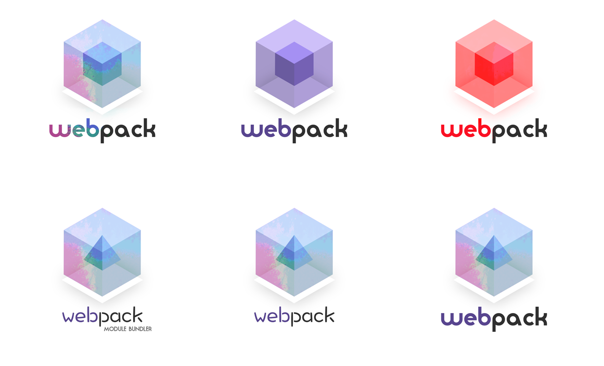

# 用户研究

[toc]

## 追根溯源

如果我们要说用户研究，就先得追根溯源，谈谈它的上游以及整个软件时代的大背景。

80后90后70后的爸妈们年轻时大多数是农民和工人，而到了我们这一代，所见的职业很多是白领蓝领，这正好说明了一个历史状况：从70年代开始，我们正从大机器生产的工业时代进入到以信息和知识为主的后工业时代，人们的职业从以前的手工业者转向政府部门、教育机构等白领职业，软件就在这样的时代背景下诞生的，它是科学进步的产物。

软件既然是科学技术的产物，必然不会是门槛很低的东西，一开始它是给科学家、军工部门和政府部门用的，用户是有技术背景的专业人士，目的是为了提高工作效率和进行严格的控制和管理。随着时间的发展，一些大的企业也需要用软件来提高生产和管理效率，软件此时从一个专业化的工具变成了代替人来工作的工具，随后又变成了能够给企业提供业务数据参考以帮助其发展的工具。与之对应的用户也从以前的技术人士变成了普通的工作人员。

技术人员使用的软件如果给到普通人去用，肯定会非常困难。这时候交互设计就出现了，它使得软件对于普通人来说，就像是一个神奇的魔术盒子，只要你按下按钮，就可以得到你想要的东西。

即使这个东西背后需要花一万个步骤，你也不必知道，完全以结果和目标为导向。所以交互设计是以目标为导向的行为设计，首要的步骤是要了解用户使用产品的目标，接下来需要在人们的行为习惯和软件的操作流程之间搭一座桥，使得用户可以顺畅低达到他们的目标。

在软件发展的初期，人和软件的关系是以软件为主的，因为软件开发的难度和时间成本很高，没有办法根据领域的不同来设计不同的软件，一个企业内部管理软件，它再难用也得用下去，没得选。公司对于效率和员工的心情上，必然会趋向前者。到了后来，技术的不断发展使得软件开发难度降低，速度加快了十几倍，使得企业对于软件有了很多的选择，并且软件扮演的角色从幕后走向了台前，客户第一接触的不是人，而是软件，所以软件的易用性成为一种竞争优势，同时内部软件的易用性也会更近一步提高了员工的工作效率。所以此时软件和人的关系变成了以人为核心，易用性的变成了口头禅。既然人是主体，当然用户研究、视觉设计也随之出现了。

### 用户研究不是救命稻草，了解它的作用比使用它更重要

用户研究并不是一个好名字，它让人觉得它的研究对象就是用户，即“使用产品的人”。但其实它包含的研究觉得非常多样化，包括利益相关者、顾客、用户、专家、竞品调研和市场、策略、业务领域调研，并且这几种调研背后对应的目的是不一样的。比如，利益相关者和顾客的调研，常常是为了更好地寻找商业模式、节省资源；用户的调研常常是为了培养用户同理心、提供设计参考；做市场、策略调研是为了确定产品的范围和用户的水平、技术的实现的程度等。

但并不是调查得越多越全越好，而是要清楚地知道自己需要什么，不需要什么，来选取调查内容。
调研所提供的价值范围限于以下几点：

- 作为一个理解的工具，帮助设计师培养同理心
- 作为管理工具，统一团队的意见，为设计提供参考依据
- 帮助设计师了解产品相关的业务和市场的上下文
- 能给不同的人提供不同的商业灵感

所以这就回答了一个问题：为什么大的互联网公司有用户研究，但是却不一定能做好产品，小的创业公司没有用户研究，但也能做出优秀的产品。因为用户研究是一种工具，有它不能救活一个产品，没它不会生产不出产品。比如一个创业公司所做的产品是针对90后，而团队本身也是90后，他们就不需要培做用研来养同理心；团队人少，意见容易达到统一，就不需要用户研究来当管理工具；ceo本身对市场和物业非常熟悉，就不需要了解更多业务，而应该把重心放在传达业务知识给团队成员上。

### 使用户调研失效的魔法

正确的认识加上正确的使用方法才能让一个工具真的发挥作用，用研作为一种工具，有它明显的“使用规范”。

从它的功效来看，第一，“作为一个理解的工具，帮助设计师培养同理心“，也就是说，设计师需要做一个90后使用的产品，最极端情况是把自己的思维行为变成90后，这样才能准确无误把握他们的需求。这就明确地规定了玩法：设计师不可能让用户研究人员去传达研究结果，因为这样的传达是没有办法培养同理心的，设计师还是会按照自己的想法设计一个产品。

第二，“能给不同的人不同的商业灵感”，意思是说在调研的过程也是一个极好的激发灵感的过程，创意不应该是一个流程中的一环，应该贯穿到整个流程中去。如果是由用研人员传递研究的信息，我们就缺失了一个大好的产生灵感的途径。且用研不是设计师，他不知道设计师需要哪些原材料，很可能会遗漏，或者完全没有抓住研究方向。而方向很可能不是一开始所计划的，而是随着调研的深入不断具象化出来的。

解决这两个问题的方法很简单：要么是让设计师自己去做调研，要么组建一支跨学科团队，让设计师和用户研究人员一起调研。

大的互联网公司的问题就在于，他们虽然有用户研究，但是由专人去做，没办法培养同理心；
至上而下的团队结构没办法成为统一的管理工具；
设计师能了解到的上下文非常有限，也不会作为工作内容之一。
设计师通常不参与商业策略研究，不用研究市场。

## 用户研究的内容

用户研究的内容，可以分为三层：

第一层是总体的研究，比如中国人消费习惯等，这些研究我们不用去做，也做不来，它非常符合统计学，所以只用买资料或者是寻找公共资源来阅读即可。

第二层是目标性的研究，我们需要搞清楚，在这个行为之后，人们的诉求是什么。人的目标随着时间可能不变化，或者变化很慢，变的是行为方式。例如从古至今我们对于沟通交流这个需求从未改变，只不过一直在用不同的方式在满足：飞鸽传书、电话、微信等。我们应该把用户的行为抽象化来思考。

第三层是环境和行为的研究，这个研究的内容是我们真正需要着力的点，它会根据环境、文化、心理、状态、时间的不同而发生变化。

### 用户调研对设计师的价值

其实，用户调研对于设计师来说只是一个工具，设计师的价值一点都不会体验在这里。

明星产品一定不是“设计师”设计出来的。这里的设计师指的是现在在市面上的视觉设计师、交互设计师、用户体验设计师。

我所理解的好产品会拥有超强的基因，能够迅速自我复制，遍地开花，在各种领域、国家、不同的人越来越多的地方使用它。这种产品一定不是设计出来的，而是长期孕育出来的，由长期在这个行业的佼佼者所创造，融合了他们过去的经验和未来的展望。uber的CEO卡拉尼克，经历了8年的创业失败，才创造出了一款让全世界为之鼓掌的移动约车产品，他成功是因为他了解所有的商业模式，有资源能力、有坚定的意志力，当下的市场也刚好成熟，所有条件都指向一个可以成功的方向，这个事情才有可能做成。

所以，每个行业的佼佼者才是最好的设计师，世界上的好产品都是由他们创造的，而只会做用户调研、画界面原型的设计师，从来不是产品的主人，而是产品的服务者。

我记得有一次给一群游泳场馆经营者做游泳相关的app产品咨询，提供产品策略咨询以及IT实施咨询，当我们激情慷慨说完方案以后，其中一个客户说：“你们说的这些我都知道，产品我自己也有了，我不知道为什么还要照你们的思路再做一个。”当时我们找了很多理由，最终谁也没有说服誰，但是我知道他是对的。这位老板每天花2-3个小时时间观察他的游泳馆，想过无数办法解决冬季场地空置的问题，走访调查过国內外的游泳馆，相信没有人比他更了解他需要的是什么，比他更清楚他所面临的问题及原因是什么。

而作为咨询师的我们所做的只是花了两周的时间进行用户访谈和调研、参考了国内外的资料、找到了游泳相关的基础调研数据，居然就能拍着胸脯说我们懂游泳行业，其实我们不懂，只是学习的能力快，比一般人要懂一些而已。

说这些并不是要表达设计师没什么用，而是要说，设计师要看清自己的定位，要了解到用户调研的局限性，我们没有办法站在客户肩膀上说话，我们只是助推器一般的角色，用我们的方法和经验，加速客户研发产品的速度，保证最终产品与初始想法的一致性。

### 未来模式

未来，软件开发成本一定会逐年降低、开发周期一定会逐年缩短，这就意味着，有可能各个行业的佼佼者也可以很轻而易举地创造出有价值的产品，而不再依赖设计师。举个例子，一个优秀的高中老师想要根据往年的教学情况和现在教学情况的对比，预测学生们考上各大院校的几率，但是学校和市面上都没有这么一款软件，于是他想自己开发一个:把往届和本届学生每次模拟考试的结果从学校数据库里面抓取出来，从各个纬度（及格率、优秀率、分数线趋势等等）做对比，就可能预测结果。理科背景的他从网上找了几个免费的数据软件组装起来，再用一个简单的合成软件把它们连接在一起，按照需要改动几个个性化的小设置，这个软件就可以跑起来了。他试着把数据导进去，真的能够显示他想要的几个预测结果，经过几个版本的迭代，这款软件已经90%能满足需求。

这个情况看起来很遥远，但是在10年以后，软件的开发成本很低、市面上有很多可组装的软件、实施周期很短，那些伴随着电子产品长大的孩子也走出社会，他们完全有能力做这样的事情的。到了那个时候，已经不可能存在用户调研的工作、也没有视觉设计师和交互设计师，也许会有新的职业叫做软件组装设计师，来为企业更为精细复杂的软件。

所以，如果现在的设计师想要在更远的未来保持高傲的姿态，就必须把设计师的身份模糊掉，要是喜欢某个行业，就深度了解这个行业的方方面-商业模式、技术、用户，积累经验和资源，做行业佼佼者；要是喜欢跨行业做咨询，就要要求自己有很好的理解力，最大程度地理解他们的业务和需求；不断积累案例，提供给客户更宽的视角和丰富的案例作为参考。
