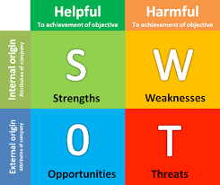
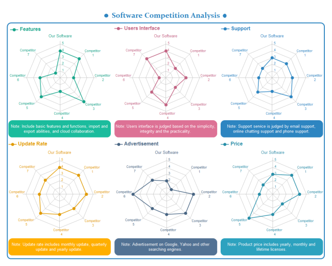

#竞品分析-产品

竞品分析是在做产品的过程中频率最高的分析之一，它常常用来帮助我们获得灵感、了解我们自身产品的不足、挖掘新的机会等。如果我们能用合理的方式来分析竞品，将会为产品提供一盏指路明灯；相反的，如果我们只是简单粗暴地对比分析，拿到结果直接指导设计，则会把产品带上歧途。

#####我常见的竞品分析有那么几种：

1. 直接复制粘贴：找到【各种相似】的竞品，把它们和自家产品对应的功能**摘出来**，照抄；
2. 取共性复制粘贴：拿市面上【标杆性】竞品做比较，找出他们共有的功能，认为别人家都有的自己必须有，抄之。
3. 融合+创新：把市面上【大部分】竞品拿过来做比较，把它们的可取之处找出来并揉在一起，在此基础上做一些适配自己产品的“创新”，让用户觉得既熟悉又有点新鲜，俗称“微创新”。

这些分析方法的初衷都是想直接从竞品分析中找到一个确定的答案。原因是自己研发创新是非常耗费时间、人力、财力的，如果能有一个市面上已过验证的功能或产品直接拿过来使用，剩下的事就只有市场运营了，将节省大量的资源，迎着风口快速成长。如当通讯软件whatsapp在2011年一炮而红过后，类似产品如雨后春笋：微信、line、viber、kik等等；魔法相机一夜走红后，face U、脸萌也应运而生。其实这种方式并不是不好的，相反的，这是一种相对聪明的商业手段。试着想想看，如果不是腾讯简单粗暴地抄袭了whatsapp，我们不可能那么快有微信那么方便的沟通工具，也不可能有微信今天如此强大的功能。我们就像偷了别人的武功秘籍，让全民都学会了轻功一样，做了一件利人利己的事情。到今天为止，一些大型互联网公司还在利用这一套路，被称为“山寨公司”也在所不辞，因为在决策者的眼里，不断抄袭别的产品，再将自己的用户流量注入到产品中，是对公司成本的极大节约。

互联网发展到今天，市场不断走向成熟，这种方式的成本也逐渐提高了。原来抄3个产品，就有1个能够赚到用户流量，而今天做10个产品都不一定有一个能活下来。当下，用户面前已经摆放了太多选项，如何拨开眼前横七竖八的相似产品，让自己发出不一样的气味吸引到用户，成为每个【后起之秀】必须要努力的事。

####我们先来看下正确的竞品分析将为产品带来哪些好处：

* **竞品分析能和用户研究互做补充。**用户研究都是关于“人”的研究，必定带有大量主观性，而竞品分析可以从“别的产品”的视角来反思自家产品，让这种主观性得到很好地控制。
* **确定市场机会。**当某个产品在市场上赢得用户的时候，一定是打开了一片新的市场，无论市场是大是小，而竞品分析能让我们知道这块蛋糕有多大，还剩多少可以分到自己碗里。
* **利用竞品分析分辨目标用户。**目标用户的确定对一个产品来说至关重要，它是我们做产品需要的第一颗定心丸，以后的所有功能都以此为基础。我们能从竞争对手那里知道我们的用户大概是那些人，不是哪些人，可以在此基础上挖掘属于自己的用户分类。
* **发现新的竞争对手。**竞品分析让我们不断挖掘新的竞争对手，甚至一些不直接竞争但是在某方面做得不错的产品。例如要做共享经济的旅游住宿产品，大家都会想到airbnb，但进一步挖掘国内市场，会发现像【小猪短租】中国版airbnb也做得不错，再进一步挖掘，发现自如租房这种针对城市上班族租房市场的产品，里面嵌套的【管家】服务，也可以拿来借鉴。

####如何做竞品分析

#####识别竞争对手--分析竞品--持续分析 

######1.识别竞争对手：你是谁，谁是你的竞争对手
如果你是在一个成熟市场中的寻求发展的产品，识别谁是你的竞争对手就犹如拜老师或者交朋友一般谨慎，因为它们将会影响你接下来走的每一步。

我们首先要做的是正确的评估自己与竞品中的区别。一个产品成功一定是多方面因素影响，切不可光看中竞品分析中的某一点，而是要做全面的对比分析。所以我们可以挑选一些差异大的或者有很深影响的纬度进行对比：资源、用户量、产品定位、使用场景、目标...等等。如下图：

下图是一个想要做银行卡【优惠】的产品，产品决策者把市面上最火的微信、支付宝、大众点评、美团、掌上生活、卡惠作为竞争对手。这几个产品有非常类似的地方，所以我们把相似的竞品先进行了合并分析，然后再按照场景、用户行为、内容体量、卖点进行了对比，用浅红色代表相似度高，深红色代表相似度较高，蓝色代表相似度低。通过对比可以清楚地发现像微信、支付宝这样的产品几乎没有太多参考性；而像掌上生活、卡惠这样的产品虽然不是市场最热的，但却是最直接的竞争对手，参考价值最大。

这样的分析能帮助我们冷却发热的头脑，认清自己是谁，谁是你的直接/间接竞争对手。

######2.分析竞品：介绍几种常用的分析工具

#####SWOT模型（Strengths、Weaknesses、Opportunities、Threats）
是一种分析产品/公司内外部竞争环境的工具，S、W指产品**内部**有哪些优劣势，O、T指的是产品**外部**市场存在哪些机会和威胁。此工具的优点在于它可以对所有类型的产品进行粗略的分析，既可以是实体的商店，又可以是线上的互联网产品。缺点在于力度比较粗，对于产品特质的抓取不是特别有力。

一个位于市中心的新品牌披萨店的例子：

**Strengths（内部优势）：**

* 产品：拥有优质的食材&配方
* 价钱：比其他流行品牌便宜
* 设计：精美的、有设计感的托盘
* 氛围：店内环境舒适，适合交谈

**Weaknesses（内部劣势）：**

* 品牌：不被大众熟知
* 员工：未经过专业的培训
* 经验：缺乏经营的经验

**Opportunities（外部机会）：**

* 受众：价格和设计吸引了许多年轻的女性
* 周边品牌：有杂志、服饰、图书等资源，可发展成为综合性的门店

**Threats（外部威胁）：**

* 对手：竞争对手能提供更多品种的披萨
* 环境：周围500米有同类型的披萨店

#####PEST模型（Political、Economic、Social、Technological）
是一种产品的宏观环境分析工具，即政治、经济、社会、科技，这些因素不受产品的的改变而改变，是对产品的孕育环境的了解，和公司的运作管理更相关。

下面有些具体的例子进一步说明：

**Political（政治因素）：**

* 贸易政策
* 股东需求
* 国家政策

**Economic（经济因素）：**

* 国外经济趋势
* 本地经济趋势
* 外汇比率
* 关税

**Social（社会因素）：**

* 宗教因素
* 地域消费行为模型
* 地域人口统计
* 地域教育程度

**Technological（技术因素）：**

* 技术发展趋势
* 技术授权/牌照
* 技术的成熟度

#####AARRR模型（Acquisition、Activation、Retention、Revenue、Refer）
是一种分析产品运营情况的模型，分别是：获取用户、提高用户活跃度、提高留存率、获取收入、自传播五个方面。比较适用于分析偏运营的产品。

AARRR模型它关注的指标，可做参考：

* 获取用户：新增用户数、CPA
* 提高用户活跃度：AU（活跃用户）、活跃率、使用时长、启动次数
* 提高留存率：次日留存率、周、月留存率
* 获取收入：ARPU（平均每位用户收入）、消费用户比例、LTV（生命周期价值）
* 自传播：K因子

#####Lean Canvas
是一种全面分析产品的方式，它包括了产品应该关注的方方面面。

#####你的产品也许不适用上面的模型，那么你可以自己制作一些图表比较：

雷达图：

气泡图：

表格打分：

#####持续分析
竞品分析不是一个一次性的分析，它需要融入在产品生命周期去，每当我们遇到困难走不下去的时候，竞品分析能帮助我们找到一些灵感，切记不要直接照搬。

#####最后，这个网站可以帮助你制作一些漂亮的分析报告:[点这里](https://app.xtensio.com/)

