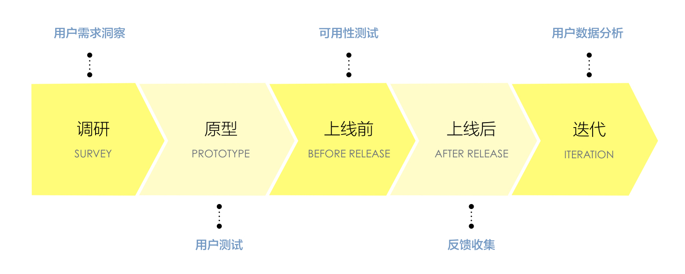
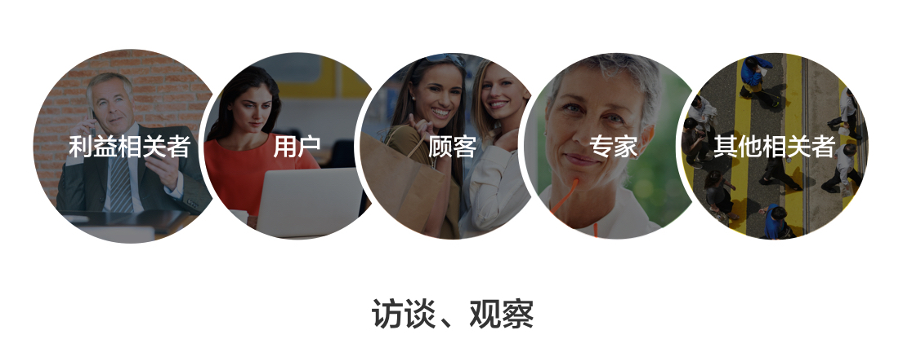

#用户访谈

#####用户访谈是什么
用户访谈是用户调研的一种方式，是最感性的方式，也是最有效了解用户的方式。
为什么最感性？因为是人与人之间的传递，无法避免大量的主观意识；为什么最有效？因为是人与人之间的传递，能感受的纬度最丰富：用户的情绪、状态、偏好、诉求，我们会被非常立体的感知所包围。就如同我们为什么看电影喜爱VR胜过3D，喜爱3D胜过2D，因为我们追求的永远是更真实的感受，而更真实的感受能带你对事物产生更准确地理解。

用户访谈从字面理解很简单，是指采访产品的终端用户，而实际上用户访谈所要达成的目标并不简单，包括用户需求洞察、用户行为分析、用户感知获取等等。用户观察和访谈是渗入到产品的整个周期的：产品初期的用户需求洞察--原型阶段的用户测试--上线前的可用性测试--上线后的反馈收集分析--迭代中的用户数据分析。


我们今天所谈论的重点是产品初期如何从用户访谈中洞察用户需求、要做哪些事情、如何利用访谈结论。

######用户访谈的价值：
* **让产品设计者代表用户发声，培养同理心。**用户访谈是一个传输“脑电波”的过程，当访谈结束，你就必须让用户的所听、所看、所想传输到自己的大脑里，让自己作为代表为他们设计。就像一个演员，他所演的不是他自己，而是代表着社会上某一类人群，他必须深刻了解这类人。假如在采访阶段没有对用户产生深刻的理解，那么设计出来的产品也必定不能帮他们解决痛点，只是为自己而设计。
* **从了解用户到理解用户，再到摆脱用户。**用户访谈让我们充分地、全方位地理解用户，然后我们才能很好地摆脱用户，why？如果我们停留在理解用户的层面，那为什么不让用户自己设计产品呢，我们需要站在比用户更高的地方去看待问题。有时候用户产生的想法和行为连自己都不能理解，例如为什么大多数人吃甜食时有一种幸福的感觉,因为我们虽然生活在丰衣足食的社会，但是我们的基因却记得远古时代风餐露宿的生活，那时找到成熟的、糖分高的果实是很难的，一旦找就会感觉非常幸福。一个普通的用户可能不会了解这些，作为设计师的我们，需要用丰富的知识回答用户行为背后的疑问。
* **让团队对“工具”有很好地认识，既不贬低它，也不抬高它。**用户访谈毕竟只是一个工具，它很好，但不是好到可以挽救一个产品；它也有缺陷，但是不可能完全没用，或者像很多人所觉得的：“调研完和我的猜想完全一样”。这个工具只有当你真正去用了，放在合适的场景下才能评价它的好坏，对一个工具的正确认识或许比这个使用工具本身更重要，起码你不会滥用这个工具，然后得出一个否定它的结论。

######用户访谈的目的：

**对于一个新产品，它能帮你：**
 
* 定义你的潜力用户群
* 找出什么是用户在产品中的诉求
* 找出高价值人群现在是怎么去解决痛点的

**对于一个已存在的产品，它能帮你：**

* 学习有关于使用产品的用户特征
* 找出用户对于产品喜欢和不喜欢的点
* 学习怎么让现有的用户使用你的产品

#####如何挑选要访谈的用户

访谈的第一步就是要知道，你要访谈谁、谁是这次的重点、谁不在这次访谈的范围之内。我们应该在采访之前就有一些分类，以下是一些可以参考的用户分类：

**1.可以从用户的类型上挑选：**

* 利益相关者：给项目资金和资源的人，能够决定项目的目标和方向；
* 用户：是使用产品的人；
* 顾客：是购买产品的人，有的产品顾客等于用户，有的产品顾客不等于用户，比如给儿童用的学习型产品，儿童是用户，但是买产品的是父母，所以父母是顾客；
* 专家：是指在产品领域内的职业玩家，有丰富的经验，比如要做理财产品，那些金融行业的人就是专家；
* 其他相关者：指的是用户周围的人，包括家人、朋友、同学等等，他们能够影响用户使用活购买产品。



**2.可以从存量用户和非存量用户挑选：**

* 存量用户：如果你的产品已经运行一段时间，那么需要从后台数据中将用户进行分类，如：按照活跃度最高、收入贡献最多来分类，对于这类种子用户需要跟踪他们的行为轨迹，了解他们更多的诉求。
* 非存量用户：指的是现在没有使用产品，但是我们希望囊括进来的用户。如：对于线上支付产品，大家都想让最主流、消费力最足的城市白领成为主要用户，但白领也许对产品并不买单。用户访谈帮我们清楚地意识到哪些非存量用户是有可能被吸引的，哪些不能。非存量用户里面又可以分成潜力用户和非用户，潜力用户是一些使用竞争对手产品的用户，要了解他们为什么偏爱对手；非用户要了解为什么他们不使用产品，有没有可能让他们变成潜力用户。


**3.可以根据猜想的纬度挑选用户：**

对于一个新的产品，就算没有非常确定的用户类型，也会有大概的用户指向，我们可根据自己猜想，用枚举的方式把用户都列下来,例如：城市白领、二线城市打工族、家庭妇女、老居民...等等。不要害怕过于主观，我们之后可以在访谈的时候再逐渐修正这些分类。


**值得注意的是：**三种挑选的纬度可能是包含关系，如：从存量用户里面挑选出来的用户，又分为用户、顾客、专家，从非存量用户挑选出来的用户，又分学生、打工族、白领、金领等等。

#####用户访谈前要准备什么

 * **用户招募：**提前一周开始招募，人数上需要有冗余，避免有用户临时不来的情况；把选定的用户分类，每类用户至少3个人以上，重点类型招募比例可加大；核对招募用户的有效性，因为招募公司业务专业性不强，找来的人有时不是非常契合。 
 * **访谈提纲：**一般调研团队是由几名设计师组成的，为了统一大家采访的思路，必须要根据每一个采访的对象制定采访提纲，如果带有实地考察的调研，要制定观察提纲。由于提纲是事先做好的，所以不可能完全符合采访的需要，所以在每一次采访过后，大家需要统一的调整提纲的问题，删除不必要的问题或者增加有价值的问题。
 * **时间计划：**访谈非常耗费体力，需要有好的精神状态，一天访谈不要超过6个，一个访谈不要超过1小时，1小时以上的提问已经得不到可信的答案。
 * **人员分工：**两人一组，一个人提问，一个人记录，为了让每个角色都有更好地参与，可在访谈中交换角色。如果有能力的话，尽量让决策者、产品经理、开发也参与前期的调研。
 * **奖品&资源消耗：**准备金额50元-200元的奖品（有一些吸引力，但也不至于花费太高），提高被访者的参积极性；准备一间温馨的办公室/studio，营造轻松自然的氛围；如果是外出访谈，准备一些易拉宝、工作牌之类的，表明身份的真实性。
 
#####几种访谈的方式

######1.一对一访谈：

我们用的最多的是一对一访谈。我们要分清楚，针对哪类用户用什么方式最有效:

**对于 To C 的产品，可采用坐谈的方式：**

To C的产品一般都是一个角色贯穿产品的始终，不用和其他角色配合完成某项工作，我们需要深入了解单个用户的方方面面，如：行为习惯、偏好、生活场景等。所以，应采用坐谈的方式，由粗到细提问，再针对某个问题分支深入挖掘。

对于决策者的访谈，同样应该采用坐谈的方式，因为领导时间少、意见重要，一对一可以问得很深入，并让他感到足够的重视。


```
图
```
**对于 to B 的产品,可采用可视化访谈的方式：**

* To B的产品，用户通常都会有上下游关系，上游把工作做完传到下游。我们需要了解的是：业务流程、人员配合关系、每个阶段的产出等等。可采用可视化的方式，如下图，边采访边画出整个工作流，再了解每个流程中的问题。

```
图
```

######2.Workshop访谈

针对企业项目的产品经理，我们通常采用workshop的形式，因为产品经理的人数比较多，大家有各自的想法不容易达成一致。workshop的好处就是能让彼此了解想法并且意见达成一致。

######3.电话访谈：
电话访谈是特别需要技巧的访谈，想象一下我们平时接到陌生来电的情景：

1. 看到陌生电话眉头一皱：谁啊，骗纸吧 
2. 接起电话不怀好意：请问你是？ 
3. 还没等对方讲完一句话，就说：不好意思不感兴趣再见，啪。

所以电话访谈首要解决的事情是要消除受访者的疑虑，否则你将一无所获。解决这一点其实也很简单，第一，需要用一个“官方”号码拨打电话，能够在用户手机上显示“XX银行”“公司”来消除疑虑；第二，通过受访者熟悉的平台邀请参与调研（如官网、facebook等），并且把时间、所需时长、主题告知受访者，让他有充足的准备；第三，赠送小礼品，让受访者乐于表达。

第二要注意的事是尽量直击要害，要重要的问题放在前面询问。因为你和受访者无法面对面，你不知道他接电话的时候在做什么，是否是一心二用或者心不在焉，所以在得到信任以后需要立即问一些核心的问题，减少相关性低的提问；对方不愿意回答的问题不要强迫追问，造成受访者的方反感，最后，如果发现受访者开始不耐烦，就快速结束对话，因为他提供的信息参考价值降低。

######4.实地考察：
实地考察的目的是为了从更客观的角度观察【事情】发生的进过，这里的【事情】可以是产品使用的流程，可以是用户痛点的产生和消解，可以是设计机会的若影若现，我们通常所用的方法是“守株待兔”和“主动出击”。守株待兔是对事先制定好的观察目标进行观察，对用户产生情感的认知，对过程提出问题；主动进攻是对问题进行回答，从各种角色、各种角度中获得答案。

#####访谈提纲包括的纬度（每个产品不同，问题不同，仅供参考）

**可以分为几类问题：**

* 基本信息：年龄、职业、工作情况居住地等
* 过程或经历：和产品相关的几个关键的场景，例如存款取款场景、买理财产品的场景等
* 态度动机：产生行为的动机
* 痛点：根据场景挖掘痛点，深入访谈
* 尝试过的方案：曾经尝试解决痛点的方案
* 愿景：希望如何改进痛点
* 工具技术：平时解决此痛点用到的工具有哪些
* 解决痛点成功的标准

**一些问问题的小技巧：**

* 介绍访谈的目的和所需时间
* 把一个问题控制在20个字以内
* 一次只问一个问题
* 问题尽量贴近用户的真实场景
* 将问题集中在用户的行为轨迹上，而非感受上
* 提供一些日期的提示帮助用户进行回忆
* 问题中带有专业性的，转化成用户的语言去问
* 使用中性的词或者语句，不让用户产生偏向
* 在必要时才涉及用户的感受或者隐私问题
* 问完一个问题时，给用户一些思考的时间，不让着急让他回答

**一些访谈时避免做的事情：**

* 让用户做选择，而选项并不符合他们实际的情况
* 问一些引导性强的问题
* 讲问题放置在错误的前提下
* 让用户讨论TA没有经历过的事情
* 让用户预测将来
* 用过于专业的词汇问问题
* 用过于情感化的词汇
* 处于好奇心问一些私人问题


#####相互制约的方法
每一个方法都不能单一地存在，必须有另外一个方法去制约和测试它的真实性，用户访谈是一种定性的方法，可以用如问卷调查、数据研究这样定量的方式来验证访谈的有效性，将用户访谈的结果导入到数据或者市场调研中去做测试，把有差异的地方拿出来做讨论，反复验证才能得到更接近真实的答案。