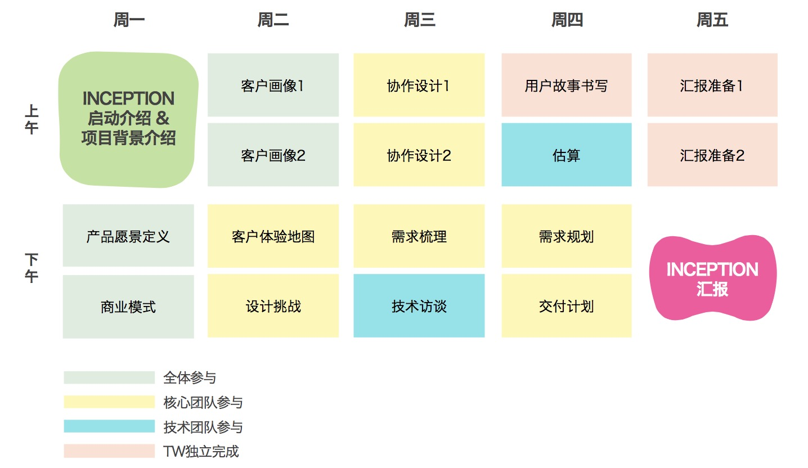
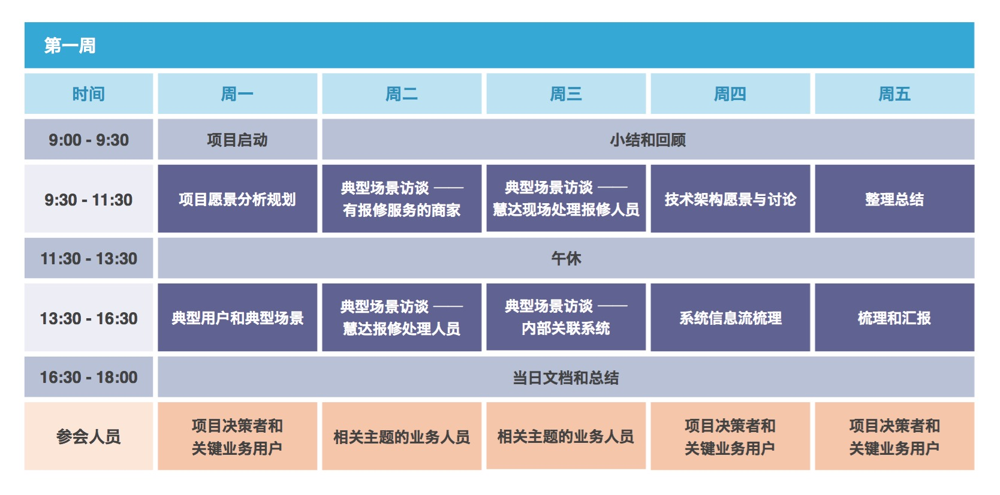
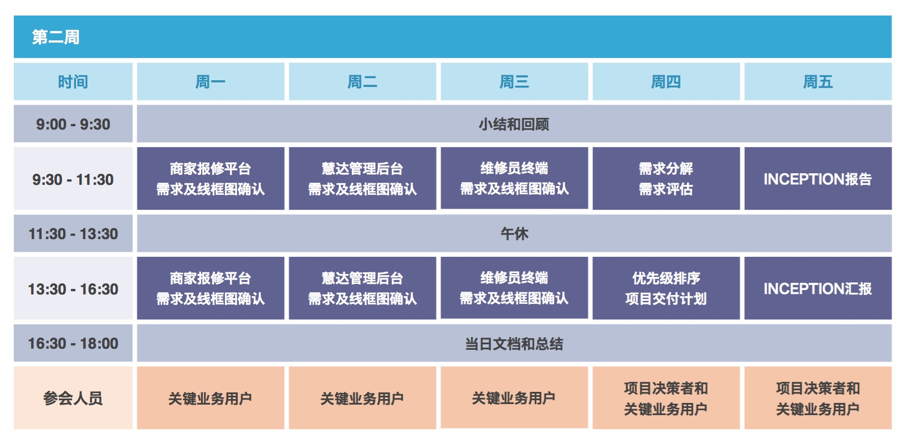
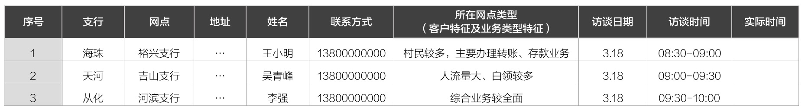
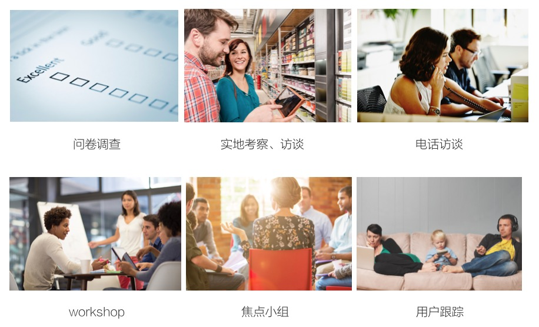

###用户研究的方法
作为一个用户体验设计师，基本上3个月就会换一个项目，从用户研究开始一直做到产品发布，每次做产品都会面临新的一轮用户研究，如何让自己的研究精准、高效、有说服力，成为了一个重要课题。

####ThoughtWorks的inception（项目快速启动）
**ThoughtWorks有一种帮助项目快速启动的方法叫inception，**这种方法帮助我们用2-4周的时间达成以下目标：明确产品策略、明确产品发展蓝图、明确基础设计和技术框架、明确交付范围、产出交付计划和时间、快速进入交付。总之，在正式写第一行代码之前，把所有东西都准备好，设计的力度细到在接下来的三个月不用做任何设计的改动，dev直接完成项目开发，直到产品上线。

**内容包括：**

* 用户调研：产品愿景、用户画像、体验地图、故事板、服务蓝图、设计机会地图；
* 设计稿输出：交互稿、视觉稿；
* 技术评估：技术栈；
* 项目交付计划：计划表，以周为颗粒度；

**分别由三种角色共同参与完成：**
设计师、业务分析师、开发

**时间周期：**
inception的周期可长可短，可根据项目调整。最健康的inception周围为一个月左右，但是在国内，由于客户接受不了一个月花了那么多钱却一行代码都看不到，所以一般我们的把inception的周期缩短为两周甚至一周，牺牲了一些深入的调研、减少了输出设计稿的数量、加强了工作的强度。

* 一周的计划长这样：

* 两周的计划长这样：

####inception中的用户调研

######接下来我会主要讲inception里面的用户研究如何做。不管时间长短，大体遵循以下步骤：
**1.首先确定调查研究的对象有哪些：**

* 利益相关者：给项目资金和资源的人，能够决定项目的目标和方向；
* 用户是使用产品的人；
* 顾客是购买产品的人，这里值得注意的是，有的产品顾客等于用户，有的产品顾客不等于用户，比如给儿童用的学习型产品，儿童是用户，但是买产品的是父母，所以他们是顾客；
* 专家是指在产品领域内的职业玩家，有丰富的经验，比如要做理财产品，那些金融行业的人就是专家；
* 其他相关者指的是用户周围的人，包括家人、朋友、同学等等，他们能够影响用户使用活购买产品。

其中利益相关者、用户、顾客是最重要的角色，应该把重点放在三者身上。确定好采访对象之后，需要制定一份采访计划，采访的对象最好能覆盖尽量丰富的样本，如学生、白领、当地老居民、外来务工者，年龄从18-23岁，其中你认为最有可能成为最终目标用户的，可以多招募几个进行采访。以下是我们之前在做银行项目时输出的采访计划：

 

**2.做桌面研究，数据挖掘。**根据你要做的产品做领域探索，输出行业调查报告。这份报告可帮助你在客户面前提高专业度，建立客户对你的信任。找到一个客户认可的行业标杆进行深入分析，一旦客户认可你的分析，将会对产品的的方向有决定性的指导意义，做差异化或者做趋同化，都能非常明确。可参考包括以下纬度：

* 市场规模有多大
* 盈利情况如何
* 一般的商业模式
* 增长态势
* 细分领域及各自的成长空间和市场成熟度
* 市场新机遇
* 风险评估
* 典型的产品详细分析

可能有很多人会问去哪里搜集材料，这里强烈推荐google，只要用英文输入关键词，所有相关的研究报告都可以找得到。
还有一些其他的参考网站：

* 艾瑞咨询搜数据相关的报告：http://www.iresearch.com.cn/
* 麦肯锡搜行业分析报告：http://www.mckinsey.com/

**3.根据你所要采访的对象分别制定采访提纲。**
一般调研团队是由几名设计师组成的，为了统一大家采访的思路，必须要根据每一个采访的对象制定采访提纲，如果带有实地考察的调研，要制定观察提纲。由于提纲是事先做好的，所以不可能完全符合采访的需要，所以在每一次采访过后，大家需要统一的调整提纲的问题，删除不必要的问题或者增加有价值的问题。

可以分为几类问题：

* 基本信息：年龄、职业、工作情况居住地等
* 过程或经历：和产品相关的几个关键的场景，例如存款取款场景、买理财产品的场景等
* 态度动机：产生行为的动机
* 痛点：根据场景挖掘痛点，深入访谈
* 尝试过的方案：曾经尝试解决痛点的方案
* 愿景：希望如何改进痛点
* 工具技术：平时解决此痛点用到的工具有哪些
* 解决痛点成功的标准

**4.选择用户调研的方式**
用户调研的方法多种多样，一般有以下几种：

我们用的最多的是一对一访谈。这种方式能充分让你产生对用户的理解，也就是同理心，也是一个让用户对你产生信任的的契机。在一对一的访谈中，所用的方式也是不同的。

* 对于to C的产品，由于用户回答的问题比较零散，随机性也比较强，可以坐谈的方式，根据提纲进行访谈；

* 对于to B的产品，用户通常都会有上下游关系，一般是由他的上游把工作做完传到他这，再由他传到下游去，这种情况如果使用坐谈的方式就会缺失掉很多细小的分支流程，所以必须以可视化的方式进行访谈，把一整个上下游的关系画出来让用户确认，并且请他的上下游的用户来做纠正，如下图：

