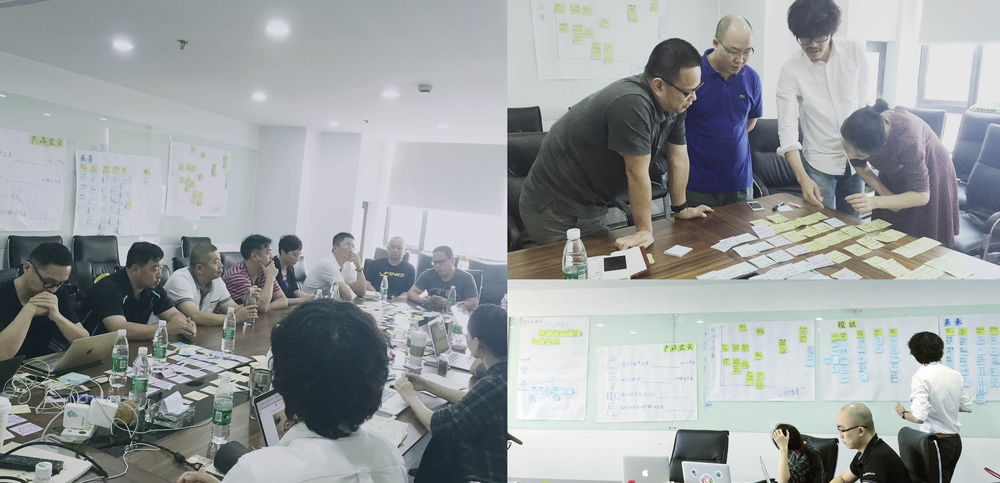
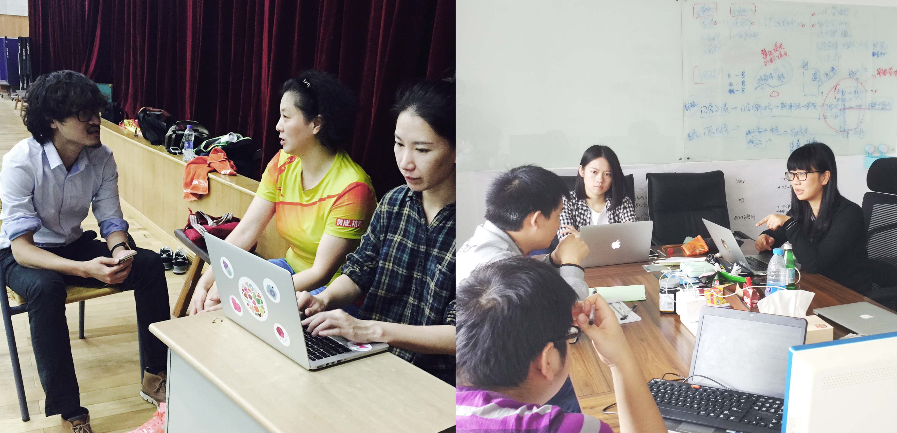

###用户研究的方法

以前在互联网公司工作的时候，设计部门的分工很细致，有交互设计、视觉设计、用户研究、前端设计，这四种角色在选人的时候各有特征，交互最好是有逻辑的理科生、视觉最好是有个性的艺术生、前端最好是有设计feel的工程师、而最特别的是用户研究，最要紧是性格好，其次最好是心理学专业。所以，用户研究永远是性格最好，最受欢迎的一群人。

**为什么性格好那么重要？难道颜值不是更重要吗？**后来我自己做了用户研究之后终于知道，每次用户研究完就像谈完一场恋爱，性格不好的人，根本没有办法谈那么多场恋爱。你需要有以下能力：当你招募用户时，你要想办法勾引他们，让他们愿意跟你谈话，并且要保证他是[对的人]；访谈时，你要理解用户，用你真诚的大眼睛看着他们，仿佛你经历过他们的痛苦，懂他们的想法；你要观察他们，发现他们想说而又不好意思说出的话；你更要爱他们，无论他们美丑胖瘦，你永远要假装认可他们所说的，让他们能说更多...

我们为什么要有那么多用户研究的方法？目的就是为了让那些性格不好的孩子也能把用研这件事做好，并且有系统、有效率、对最终设计提供帮助。

####ThoughtWorks的inception（项目快速启动）
**ThoughtWorks有一种帮助项目快速启动的方法叫inception。**这种方法帮助我们用2-4周的时间谈一场轰轰烈烈的恋爱，并且能产出很多惊人的成果：产品策略、交互设计、技术框架、交付计划。它的目的就是在正式写第一行代码之前，把所有原材料都准备好，力度细到在接下来的三个月不用做任何设计的改动，dev直接完成项目开发，直到产品上线。

有人可能会问，你们如此短的时间内出来的东西真的可靠吗？
答案是：可靠。原因是：**我们不是要帮客户想出解决问题的方法，而是去引导他们自己想出方案。**我们面临的客户通常是金融行业、零售行业，这些行业需要有很深的行业积累，客户一般都是在这个行业8-10年的人，所以脑子里已经装满了对这个行业各种可能性的想法，只是他们不知道该如何做起、要做成什么样才算好、别人是如何做的。作为软件行业的咨询师，我们清楚地知道产品应该长什么样子，如何构建这个产品，也正好有很多相关的行业经验可以输入给客户。我们拥有深刻的业务理解能力和快速构建IT产品的方法，只要用适当的方法把客户脑子里的想法牵引出来，梳理成可行的业务框架，最后就可以形成一个可靠的IT产品，这个过程就像把一些原材料按照菜谱进行烹饪一样，方法得当，速度和质量都有办法保证。

**以下是我们inception输出的基本内容：**

* 用户调研：产品愿景、用户画像、体验地图、故事板、服务蓝图、设计机会地图；
* 设计稿输出：交互稿、视觉稿；
* 技术评估：技术栈；
* 项目交付计划：计划表，以周为颗粒度。

**分别由三种角色共同参与完成：**

业务分析师、设计师、开发。
假如把一个产品诞生的过程比喻成做菜，几种角色在后厨房进行配合，那么设计师就是买菜的，把客户的想法牵引出来，过滤掉没用的，留下精华的洗净切好，变成可用的原材料；业务分析师就是设计菜谱的，分析这些原材料适合做什么菜、根据餐馆的调性定义菜品的口味；开发就是做菜的，利用原材料+菜谱做出符合预期的菜品，快速、保质保量。三种角色缺一不可，并且有先后出场的顺序。

**时间周期：**

inception的周期可长可短，可根据项目调整。最健康的inception周围为一个月，但是在国内，由于客户接受不了一个月花了那么多钱却一行代码都看不到，所以一般我们的把inception的周期缩短为两周甚至一周，好处是能更快速地验证想法，坏处是牺牲了一些深入的调研、加强了工作的强度。

* 一周的计划长这样：

* 两周的计划长这样：

####inception中的用户调研

接下来我会主要讲inception里面的用户研究如何做。我们先来温习一下用户研究的目标：

* 作为一个理解的工具，帮助设计师培养同理心
* 作为管理工具，统一团队的意见，为设计提供参考依据
* 帮助设计师了解产品相关的业务和市场的上下文
* 能给不同的人提供不同的商业灵感

**作为一个理解工具，我们首先要知道，我们要理解谁，和谁谈恋爱。所以，在一切开始之前，请确认你的对象是谁，一般有以下类型：**

* 决策者：给项目资金和资源的人，能够决定项目的目标和方向；
* 用户：是使用产品的人；
* 顾客：是购买产品的人，这里值得注意的是，有的产品顾客等于用户，有的产品顾客不等于用户，比如给儿童用的学习型产品，儿童是用户，但是买产品的是父母，所以他们是顾客；
* 专家：是指在产品领域内的职业玩家，有丰富的经验，比如要做理财产品，那些金融行业的人就是专家；
* 其他相关者：指的是用户周围的人，包括家人、朋友、同学等等，他们能够影响用户使用活购买产品。

确定好采访对象之后，需要制定一份采访计划，采访的对象最好能覆盖尽量丰富的样本，目的是为了让设计师能尽量挖掘这个产品的机会点，从一些边缘的用户群体中也能挖掘出新的产品可能性。例如：市面上的银行业务都是存款取款借贷等，但其实他们的用户都是有特征的，招商银行主要用户是上班族、民生银行的主要用户是打工族。当主流用户都被各大银行瓜分走的时候，小银行如果才能做出区别于他们的产品，如何才能拥有自己专有的用户特征而不轻易被抄袭？这就需要在甄选用户的时候尽量去挖掘“非主流”用户，从他们身上挖掘到机会点，这些类型的用户虽然量级不大，但却是做好口碑和自身品牌的良方。

以下是我们之前在做银行项目时输出的采访计划：

 

**2.做桌面研究，数据挖掘。**根据你要做的产品做领域探索，输出行业调查报告。这份报告可帮助你在客户面前提高专业度，建立客户对你的信任。找到一个客户认可的行业标杆进行深入分析，一旦客户认可你的分析，将会对产品的的方向有决定性的指导意义，做差异化或者做趋同化，都能非常明确。可参考以下纬度：

* 市场规模有多大
* 盈利情况如何
* 一般的商业模式
* 增长态势
* 细分领域及各自的成长空间和市场成熟度
* 市场新机遇
* 风险评估
* 典型的产品详细分析

可能有人会问去哪里搜集材料，这里强烈推荐google，只要用英文输入关键词，所有相关的研究报告都可以找得到。
还有一些参考网站：

* 艾瑞咨询搜数据相关的报告：http://www.iresearch.com.cn/
* 麦肯锡搜行业分析报告：http://www.mckinsey.com/

**3.根据你所要采访的对象分别制定采访提纲。**
一般调研团队是由几名设计师组成的，为了统一大家采访的思路，必须要根据每一个采访的对象制定采访提纲，如果带有实地考察的调研，要制定观察提纲。由于提纲是事先做好的，所以不可能完全符合采访的需要，所以在每一次采访过后，大家需要统一的调整提纲的问题，删除不必要的问题或者增加有价值的问题。

可以分为几类问题：

* 基本信息：年龄、职业、工作情况居住地等
* 过程或经历：和产品相关的几个关键的场景，例如存款取款场景、买理财产品的场景等
* 态度动机：产生行为的动机
* 痛点：根据场景挖掘痛点，深入访谈
* 尝试过的方案：曾经尝试解决痛点的方案
* 愿景：希望如何改进痛点
* 工具技术：平时解决此痛点用到的工具有哪些
* 解决痛点成功的标准

**4.选择用户调研的方式**
用户调研的方法多种多样，一般有以下几种：

我们用的最多的是一对一访谈。这种方式能充分让你从一问一答中产生对用户的理解，也就是同理心，也是一个让用户对你产生信任的的契机。我们需要学会的是，针对不同的采访对象、不同情况下，需要有不同的方式或者两三种方式结合。例如：针对企业项目的决策者，我们通常采用workshop的形式，一次性请10个左右的项目相关人一起参加，目的之一是让这些人通过我们的引导，从思想上能够达成一致，避免出现A领导的想法B领导不知道或不同意，导致项目做到一半突然跳出一个领导把方案推翻重来；目的之二是让大家熟悉我们的做事方式，让他们认可我们梳理需求的思路，证明这钱花的值得。

所以，我们通常会面临这样的场面,一群企业高层聚首会议室听我们指挥，极度考验心理素质：

* 对于to C的产品，由于用户回答的问题比较零散，随机性也比较强，可以坐谈的方式，根据提纲进行访谈；

* 对于to B的产品，用户通常都会有上下游关系，一般是由他的上游把工作做完传到他这，再由他传到下游去，这种情况如果使用坐谈的方式就会缺失掉很多细小的分支流程，所以必须以可视化的方式进行访谈，把一整个上下游的关系画出来让用户确认，并且请他的上下游的用户来做纠正，如下图：

